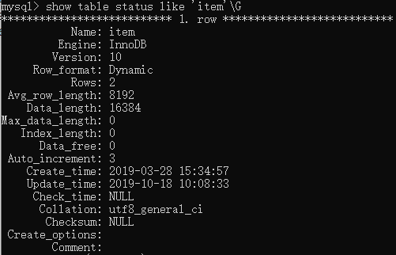
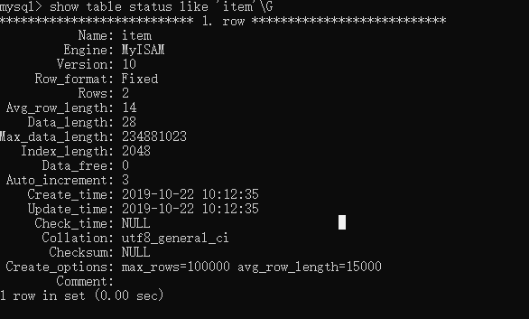

# MySQL的架构
MySQL的逻辑架构图主要如下:

由架构图可以得知，MySQL的架构主要由三层组成
* 最上层是很多应用都有的,主要是客户端/服务器的的C/S架构，这一层主要负责连接处理，授权认证，安全等.

* 第二层是MySQL的核心服务功能，这一层包括了查询解析，分析，优化，缓存一级所有的内置函数(例如，日期前，时间，数学和加密函数)，
所有的存储引擎的功能都在这一层实现:存储过程，触发器，试图等

* 第三层包含了存储引擎。存储引擎负责MySQL中数据的存储和提取。和GUN/Linux下的格字文件系统一样，每个存储引擎都有他的又是和劣势。
服务器通过API与存储引起进行通信。这些接口屏蔽了了不同的存储引擎之间的差异，是的这些差异对上层的查询过程是透明的。存储引擎的API包
含了几十个底层的函数，用于执行注入"开始一个事务"或者"根据注解提取一行记录"等操作。但是存储引擎不会去解析SQL，不同的存储引起之间
也不会互相通信。

## 连接管理与安全性

* 客户端的连接：每个客户端连会在服务器上用于一个线程，这个连接查询指挥在这个单独的线程中执行，该线程只能轮流的在某个CPU核心或者CPU中执行。
服务器负责缓存线程，因此不需要未每一个新建的的连接创建或者销毁线程。

* 连接安全性：当客户端连接到MySQL服务器上时，服务器需要对其进行认证。认证用户名，原始主机信息和密码。如果使用了安全套接字(SSL)
的方式连接，可以使用X.509证书认证。一旦客户端连接成功，服务器就会继续验证该客户端是否具有某个执行特定查询的权限。

## 优化与执行

MySQL会解析查询,并发创建内部数据结构(解析树),然后进行格字优化，包括重写查询，决定表的读写顺序，以及选择合适的索引等。
用户可以通过特殊的关键字提示优化器，影响他的决策过程。也可以请求优化器解释(explain)优化过程的的各个因素，使用户可以
知道服务器时如何进行优化决策的，并且提供一个参考基准，便于用户重构查询和schema，修改相关的配置，时用于尽可能的高效运行。

优化器不关心使用的时什么存储引擎，但是存储引擎对于优化查询是有影响的。优化器会请求存储引擎提供容量或者某个具体的操作
开销信息，以及表数据的统计信息等，

## 并发操作

同一时刻对相同的数据进行操作会出现数据的不一致问题，解决这个问题可以加锁，但是这种方式是不能处理并发处理的，
某一个时刻只能处理一个请求。

### 读写锁

可以通过实现一个有两种类型的锁组成的锁系统来解决问题。这两种锁通常可以被称为共享锁(shared lock)和排他锁(execusive lock),
也叫读锁(read lock)和写锁(write lock).读锁是共享的，是非阻塞的。多个客户在同一个时刻是可以同时读取同一个资源的，互相不干扰。
写锁则是排他的，一个写锁会阻塞其他的写锁和读锁

### 锁的粒度

* 表记锁

* 行级锁

## 事务

事务就需要使用到ACID，ACID测试通常需要更强的CPU处理能力，更大的内存很更多的磁盘的空间。

* A(actomicity)原子性

* C(consistency)一致性

* I(isolation)隔离性

* D(durability)持久性

## 隔离级别

SQL中定义了四种隔离级别，每一种隔离级别都规定了一个事务中所做的秀爱，那些在事务内和事务间是可见的，较低级别的隔离通过可以执行
更高得并发，系统得开销更低

* READ UNCOMMITTED(未提交读)

在该级别中，事务中的修改及时没有提交，对其他事务也是可见的。事务可以读取为提交的数据，这也被称为脏读(Dirty Read)。
这个级别可能会导致很多问题，一般的开发很少使用。

* READ COMMITED(提交读)

大多数的数据库系统的默认隔离级别都是这个级别(MySQL不是)。该级别的事务就从开始之前到所做的任何修改对其他的事务都是不可见的。。
这个级别也叫不可重复读(nonrepeatable read),因为两次都是中性统一的查询，可能会得到不一样的结果.

* REPEATABLE READ(可重复读)

该级别的事务可以解决脏读的问题。该级别保证了同一个事务中多次读取统一的记录的结果是一致的。但是理论上，可重复读隔离级别还是无
法解决另外一个欢度的问题。幻读就是当某个事务在读取某个方位内的记录时，灵位一个事务又在该范围内插入了新的记录，当之前的事务再次
读取该范围内的的会产生幻行。InnoDB和XtraDB是通过多版本并发控制(MVCC,Mutiversion Concurrency Control)来解决幻读的问题的。

* SERIALIZABLE(可串行化)

该级别的的事务是最该级别的事务，避免了前面说的幻读问题，它会在每行在读取的数据上加锁，所以可能导致大量的超时和
锁争用的问题。实际应用中很是使用该级别，只有在接收了数据的一致性和没有并发的情况才会使用。

我们可以使用SET SESSION TRASNACTION ISOLATION LEVEL READ COMMITED;设置当前绘画的隔离级别.

### 事务日志

事务日志可以帮助提高事务的的效率，使用事务日子，存储引擎在修改表的时候只需要修改器内存拷贝，在把该修改的行为记录到持久在硬盘的
事务日志中，而不是每次的修改都持久化到磁盘上。事务日志采用的是追加的方式,因此写日志的操作都是磁盘上一块区域内存的顺序的I/O，而不是
随机的I/O需要在磁盘的多个地方移动刺头，索引采用事务日志的方式相对来说要快得多。事务日志持久之后，内存被修改的数据在后台可以慢慢的
刷会到磁盘。

## MySQL中的事务

MySQL提供了两种事务型的存储引擎：InnoDB和NDB Cluster。另外有一下第三方的存储引擎的也持之事务，例如XtraDB和PBXT

### 字段提交(AUTOCOMMIT)
MySQL默认的自动提交模式，也就是说。如果不是现实的开始一个事务，则每个查询都被当做一个事务执行提交操作。在当前链接中，
可以通过设置AUTOCOMMIT便利来启动或者禁用自动提交模式:
我们可以使用SHOW VARIABLES LIKE 'AUTOCOMMIT';查看事务自动提交是否开启

我们可以使用 SET AUTOCOMMIT=1;开启事务自动提交，SET AUTOCOMMIT=0;关闭事务自动提交。当我们关闭了之后，索引的操作都在一个
事务当中，知道我们显示的COMMIT提交或者ROLLBACK回滚，该事务结束，同时又开始可另外一个新的事务。修改AUTOCOMMIT对于非事务型的
的数据库不会有任何的的影响。

### 在事务中混合使用存储引擎

在事务事务中混合使用了事务性和非事务型的表，正常的情况不会出现什么问题，但是如果真的要回滚，非事务的表变得无法撤销，这种情况将无法确定。

### 隐式和显示锁定

InnoDB采用的是两段锁定协议(two-phase locking protocol).在事务执行的过程中随时都可以执行锁定，锁只有在执行commit或者rollback才会
释放

## 多版本并发控制

MySQL的大多数事务型存储引擎实现的都不是简单的行级锁。基于提升并发性能的考虑，它们一般都实现了多版本的（MVCC），其他的数据库，
例如Oragle，PostgreSQL等其他数据库系统都是实现了MVCC，每种数据库实现的额不尽相同。

MVCC的是行级锁的变种，它在很多情况下避免了加锁的操作，开销更低.它是通过保存数据在某个时间点的快照来实现的。也就是说，
不管执行多长时间，每个是事务看到的数据都是一致的。

在InnoDB的MVCC中，是通过在每行记录后保存两个隐藏的列来实现的。这两个列，一个保存了行的创建时间，一个保存行的过期时间(或者是删除时间)。
其实这个记录的不是具体的时间值，而是系统的版本号，每开始一个新的事务，系统的版本号就会自动增长。事务开始时刻的系统版本号会作为事务
的版本号，用来查询到的没行记录到的版本号进行比较。

SELECT 
    InnoDB会根据以下两个条件检查没行的记录:
        a. InnoDB只查找版本早于当前事务版本的数据行(也就是，行的系统版本号小于或者等于事务的系统版本号)，这样可以确保事务读取的行，
        要么是下事务的开始前已经存在的，要么是事务自身插入或者修改过的。
        
        b. 行的删除版本要么未定义，要么大于当前事务版本号.这可以确保事务读取到的行，在事务开始前违背删除.
        
    只有符合上述的两个天花的户口也们才能返回系统版本号作为行版本号. 

INSERT  
    InnoDB未插入的没一行保存当前系统的的版本号作为行版本号
DELETE
    InnoDB 为删除的没一行保存当前系统的版本号作为行删除标识
UPDATE
    InnoDB为插入的一哈给新记录，保存当前系统的版本号做为行版本号，同时保存当前系统的版本到原来的行作为行删除标识.
    

保存这个两个额外的版本号，是大多数读操作都可以不需要加锁。这设计使得读数据操作很简单，性能也很好，并且也能够保证只会读取到符合标准的行
不足之处是没行的记录都是需要额外的存储空间，需要做更多的行检查工作，以及一些额外的维护工作.

**注意**

MVCC只支持REPEATABLE READ和READ COMMITED两个隔离级别的工作。其他的两个隔离级别都是和MVCC不兼容的，因为READ UNCOMMITED总干事读取最新的行数据，
而不符合当前事务版本的数据。而SERIALIZABLE则会多所以的读取的行都加锁.

## MySQL的存储引擎

在文件系统中，MySQL将每个数据库(也可以成为schema)保存为数据目录下的一个子目录。创建表时，MySQL会在数据库子目录下创建一个和表名同名的
.frm文件保存表的定义。数据库的定义和表的定义一般都是存储在文件系统的目录和文件里面，统一由MySQL服务器层处理.

我们可以使用SHOW TABLE STATUS '表名'\G查看相关的信息,查询回来的信息如下:

详解：

Name:表名

Engine:表的存储引擎的类型。在就版本中，该列表的名字叫Type，而不是Engine.

Row_format:行的格式，对于MyISAM表，可选择的值为Dynamic,Fixed或者Compressed.Dynamic的行长度是可变的，一般包含可变长度的字段，例如VARCHAR
或者BLOB。Fixed的行长度增势固定的，只有包含固定长度的列表，如CHAR和INTEGER.Compressed的行则只在要锁表中存在。

Rows:表中的行数，对于MyISAM和其他的一些存储引擎，该值是精确的，但是对于InnoDB,该值是估计值。

Avg_row_length:平均的每行包含的字节数.

Data_length:表数据的大小

Max_data_length:表数据的最大容量，该值和存储引擎相关。

Index_length:所以的大小.

Data_free:对于MyISAM表，标识以及分配单目前还没有使用的空间。这部分空间包括了之前删除的行，以及后续可以被INSERT的利益的空间.

Auto_increment:下一个AUTO_INCREMENT的值。

Create_time:表创建的时间。

Update_time:表更最后的修改时间。

Check_time:使用CHECK TABLE命令或者myisamchk工具最后一次检查表的时间。

Collation:表的默认字符集和字符列拍寻规则。

Checksum:如果启用，保存的是整个表的试试校验和。

Create_options:创建表时指定的其他选项。

Comment:该列包含了一些额外的信息。对于MyISAM表，保存的时表在创建时带的注释。对于InnoDB,则保存的时InnoDB表空间剩余的空间信息，
如果时一个试图，则该列包含了"VIEW"的样本字样.

### InnoDB存储引擎

InnoDB是MySQL的默认引擎，也是最重要的，使用最广泛的存储引擎。被设计用来处理大量的短期事务，短期事务大部分情况是正常的提交的，很少会被回滚。
InnoDB的性能和自动奔溃回复特性，使得他再非事务型的存储的需求中也很流行。

**注意**
除非特别的特别的原因需要使用其他的存储引擎，否则应该邮箱考虑使用InnoDB引擎

#### InnoDB的概览

InnoDB的数据存储在表空间中，表空间是InnoDB管理的一个黑盒子，由一些列的数据文件组成。MySQL4.1之后，InnoDB可以将没给表的数据和所以
存储在单独的文件中。InnoDB也可以使用裸设备作为表 空间的存储介质，但现代的文件系统使得洛社别不再是必要的选择。

InnoDB采用MVCC来支持搞并发，并且实现了四个标准的的隔离级别。器默认级别是REPEATABLE READ(可重复读)，并且通过其间隙锁
(next-key locking)策略防止幻读的出现。间隙锁使得InnoDB不仅仅锁定查询涉及的行，还会对所以的中的间隙进行锁定，以防止幻影的插入。

InnoDB的表是基于聚簇索引建立的。InnoDB的所有结构和MySQL的其它存储引擎的索引由很大的区别，聚簇索引对主键查询由很高的性能。
但是它的二级索引(secondary index,非主键索引)必须包含主键列，索引如果主键列很大的话，其他的索引也会很大。因此，若表表上的索引较多
的话，主键应当的尽可能的小。InnoDB的存储格式是平台独立的，也就是说可以将数据和索引文件从Intel平台的复制到PowerPC或者Sun SPARC平台.

InnoDB内部做了很多的优化，在磁盘读取数据时采用的可预测性预读，能够字段的在内存中创建hash索引(adaptive hash index),以及能够加速插入
缓冲区的。

### MyISAM存储引擎

MyISAM在MySQL5.1之前时MySQL默认的存储引擎。而且MyISAM提供了全文索引，压缩，空间函数(GIS),但是MyISAM不支持事务和行级锁。
而且由一个毫无疑问的缺陷就是无法在奔崩溃之后安全的恢复。

存储：
    
         MyISAM会将表存储在两个文件中：数据文件换个索引文件，分别以.MYD和.MYI为拓展名。MyISAM表可以包含动态和静态(长度固定的)行。
    MySQL会根据表的定义来决定采用何种行格式。MyISAM表可以存储怒的行记录数，一般受限于可用的磁盘空间，或者操作系统中单个问九年的最大尺寸。
    
         MySQL5.0中，MyISAM表如果时可变长行，默认配置只能处理256TB数据，因为只想数据记录的指针长度时6字节。而在更早的版本中，
    指针长度默认是4字节，所以最大只能处理4GB的数据。MySQL的版本是支持8字节的指针的。要改变MyISAM表指针长度(调高或者调低)，可以通过修改表的MAX_ROWS
    和AVG_ROW_LENGTH选项值老实现。两者的相乘就是表科大到的最大大小。修改这两个参数会导致重新构建整个表和表的索引，这个可能需要话很长的时间.
    具体可以使用下面的sql语句修改:alter table  table_name  MAX_ROWS=1000000000 AVG_ROW_LENGTH=15000;
    
执行之后查看表可以看到如下结果:

    
    
#### MyISAM特性

* 加锁与并发
MyISAM对整个表加锁，而不是针对行。读取时会对需要读到的所有表加共享锁，写入时则对表加排他锁。但是在表由读取查询的时候，
也就可以往表中插入新的记录(这个被成为并发插入,CONCURRENT INSERT)。

* 修复

对于MyISAM的表，MySQL可以手工的或者自动执行检查和修复操作，但是说的修复和事务恢复不是一个概念。执行表的修复可能导致一些数据的丢失，
而且修复操作是非常慢的。可以通过CHECK TABLE mytable 检查表的错误，如果有错误可以执行REPAIR TABLE mytable进行修复。如果服务器以及关闭，
可以通过myisamchk命令工具进行检查和修复操作.

* 索引特性

对于MyISAM表，即使BLOB和TEXT等长字段，也可以基于前500个字符创建索引。MyISAM也支持全文索引，这是基于分词创建的索引，
也可以支持复杂的查询。

* 延迟更新索引

创建MyISAM表的时候，如果指定了DELAY_KEY_WRITE选项，在每次修改执行完成时，不会立刻将修改的索引数据写入磁盘，而是会写道内存中的键缓冲区，
只有在清理键缓冲区还过着关闭表的时候才会将对于的所有块写入到磁盘。这种方式可以极大的提升写入的性能，但实际在数据库或者主机崩溃的时候造成
索引的损坏，需要执行修复操作，延迟更新索引将的特性，可以在全局设置，也可以为单个表设置.

### MyISAM压缩表

如果在创建表并且导入数据之后就不做任何的修改操作，那么这样的表或许适合次啊用MyISAM压缩表。我们可以使用myisampack对MyISAM表进行压缩
(也叫打包)。压缩表是不能修改的，除非接触压缩，修改之后再修改。

### MyISAM性能
MyISAM引擎涉及简单，数据以紧密的格式存储，索引在某些常见下的性能很好.MyISAM有一些服务器级别的性能拓展限制，比如对所有键缓冲区的
的Mutex锁,MariaDB基于段(segament)的索引键缓冲区机制来避免该问题。但是MyISAM最典型的醒脑静问题还是表锁的问题，比如你发现索引都
长期处于"Locked"状态，那么毫无疑问时表锁就是罪魁祸首。

### 转换表的引擎

将表从一个引擎修改为另外一个我们只需要使用ALTER TABLE语句。下面的语句将mytable的引擎修改InnoDB

        ALTER TABLE mytable ENGINE=InnoDB

上面这个方式修改存储引擎，将会时区和原引擎想关的特性，例如会丢失外键。

#### 导出和导入

可以使用mysqldump工具将数据导出到文件，然后修改建表的语句的存储引擎的选项。

#### 创建和查询

综合第一种方法的搞笑和第二章方式的安全部，我们可以想创建一个新的存储引擎的表，然后利用INSERT...SELECT语法来导入到新的表
如果数据量不是很大的话可以使用下面的方式：

1. CREATE TABLE innodb_table LIKE myisam_table;
2. ALTER TABLE innodb_table ENGINE=InnoDB;
3. INSERT INTO innodb_table SELECT *FROM myisam_table;

如果数据量很大话可以批量的处理:

1. START TRANSACTION;
2. INSERT INTO innodb_table SELECT *FROM myisam_table WHERE id BETWEEN x AND y;
3. COMMIT

 
    
    
    
    
    
    
    
    
    
    
    
    
    
    
    
    

    
      

 

