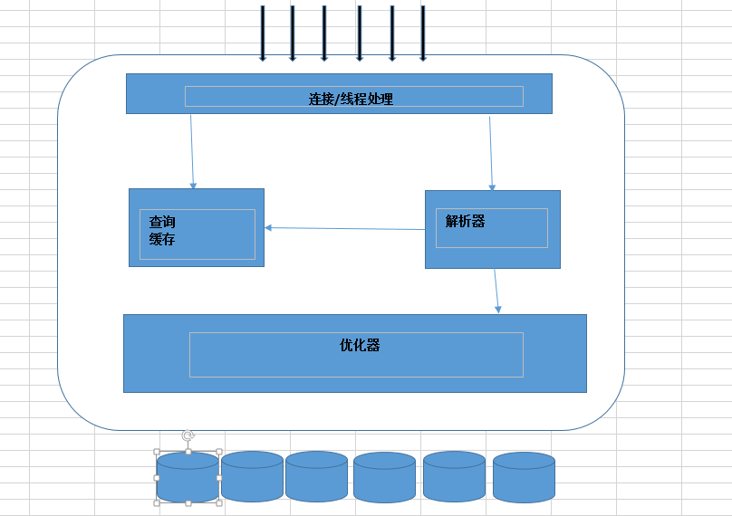

# MySQL的架构
MySQL的逻辑架构图主要如下:

由架构图可以得知，MySQL的架构主要由三层组成
* 最上层是很多应用都有的,主要是客户端/服务器的的C/S架构，这一层主要负责连接处理，授权认证，安全等.

* 第二层是MySQL的核心服务功能，这一层包括了查询解析，分析，优化，缓存一级所有的内置函数(例如，日期前，时间，数学和加密函数)，
所有的存储引擎的功能都在这一层实现:存储过程，触发器，试图等

* 第三层包含了存储引擎。存储引擎负责MySQL中数据的存储和提取。和GUN/Linux下的格字文件系统一样，每个存储引擎都有他的又是和劣势。
服务器通过API与存储引起进行通信。这些接口屏蔽了了不同的存储引擎之间的差异，是的这些差异对上层的查询过程是透明的。存储引擎的API包
含了几十个底层的函数，用于执行注入"开始一个事务"或者"根据注解提取一行记录"等操作。但是存储引擎不会去解析SQL，不同的存储引起之间
也不会互相通信。

## 连接管理与安全性

* 客户端的连接：每个客户端连会在服务器上用于一个线程，这个连接查询指挥在这个单独的线程中执行，该线程只能轮流的在某个CPU核心或者CPU中执行。
服务器负责缓存线程，因此不需要未每一个新建的的连接创建或者销毁线程。

* 连接安全性：当客户端连接到MySQL服务器上时，服务器需要对其进行认证。认证用户名，原始主机信息和密码。如果使用了安全套接字(SSL)
的方式连接，可以使用X.509证书认证。一旦客户端连接成功，服务器就会继续验证该客户端是否具有某个执行特定查询的权限。

## 优化与执行

MySQL会解析查询,并发创建内部数据结构(解析树),然后进行格字优化，包括重写查询，决定表的读写顺序，以及选择合适的索引等。
用户可以通过特殊的关键字提示优化器，影响他的决策过程。也可以请求优化器解释(explain)优化过程的的各个因素，使用户可以
知道服务器时如何进行优化决策的，并且提供一个参考基准，便于用户重构查询和schema，修改相关的配置，时用于尽可能的高效运行。

优化器不关心使用的时什么存储引擎，但是存储引擎对于优化查询是有影响的。优化器会请求存储引擎提供容量或者某个具体的操作
开销信息，以及表数据的统计信息等，

## 并发操作

同一时刻对相同的数据进行操作会出现数据的不一致问题，解决这个问题可以加锁，但是这种方式是不能处理并发处理的，
某一个时刻只能处理一个请求。

### 读写锁

可以通过实现一个有两种类型的锁组成的锁系统来解决问题。这两种锁通常可以被称为共享锁(shared lock)和排他锁(execusive lock),
也叫读锁(read lock)和写锁(write lock).读锁是共享的，是非阻塞的。多个客户在同一个时刻是可以同时读取同一个资源的，互相不干扰。
写锁则是排他的，一个写锁会阻塞其他的写锁和读锁

### 锁的粒度

