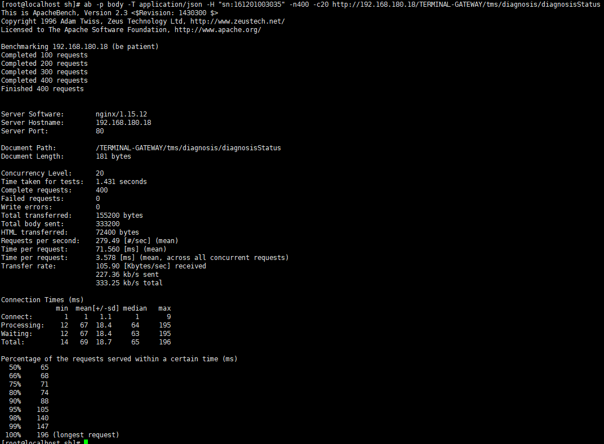
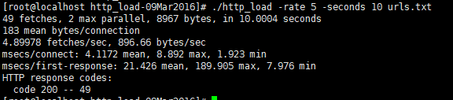

# MySQL 基准测试

基准测试(benchmark)是MySQL的新手和专家都需要掌握的一项针对系统涉及的压力测试的技能，
以测试的数据作为掌握系统的行为，重现系统的状态，或者是硬件的可靠性测试.

## 基准测试的可以做什么

* 验证基于系统的假设，看是否符合实际要求。

* 重现系统的异常行为，以帮助解决这些异常。

* 测试系统的当前的运行情况。

* 模拟更高的系统负载，以找出系统拓张的瓶颈。

* 规划未来的业务增长。

* 测试应用适应可变环境的能力。这些测试数据可以帮助我们确定未来负载需要的硬件，网络，以及相关的资源等.

* 测试应用可变环境的能力。

* 测试不同的硬件，软件和操作系统的配置

* 证明新采购的设备是否配置正确

## 基准测试的问题

* 测试的不是真实的数据，测试出的结果可能不能得出正确的结论。

* 测试工具的局限性，影响到了结果的有效性。

## 基准测试的策略

1. 集成式测试

    * 测试整个应用系统，Web服务器，应用代码，网络和数据库是非常有用的，因为整体的性能才是用户关注的。
    * MySQL并非总是应用的瓶颈。
    * 对应用做整体测试，才发现各部件之间的缓存带来的影响。
    * 整体的集成测试才能揭示更加真实的表现，单独的测试组件无法满足这个要求

2. 单组件式基准测试

整体的集成式测试有时候时很困难的，而且一旦数据不准确就无法反映真实的情况。如果在不是需要了解整体的应用的情况下，
我们可以只关注mysql：

    * 比较不同schema的查询性能
    * 针对某个具体问题的测试
    * 避免漫长的测试，可以通过一个短期的基准测试，做快速的"周期循环"来检测整体的效果.
    

## 测试指标

* 吞吐量:单位时间内的事务处理

* 响应时间或者延迟:这个指标用于测试任务所需要的整体时间。

* 并发性: 并发性是一个非常重要有经常被误解和误用的指标.

* 可拓展性:给系统增加一倍得资源就可以获得两倍得吞吐量，但是实际上是做不到得。

## 涉及和规划基准测试

规划基准测试的第一步需要剔除问题并且明确目标。然后决定采用标准的基准测试还是设专用的测试。确定要进行基准测试的系统
是OLTP型(事务型的系统)，还是OLAP型(分析决策型).尽可能的使用数快照(而且是数据奥酚时期的)来还原数据进行测试，而且做
好测试数据，系统配置的步骤，测量和分析结果，以及预热的方案.

## 基准测试应该多运行多长时间

基准测试的规则要求，系统看起来稳定的时间就是系统预热的时间，选择合适长度的时间进行测试才能得到更加充分的结论，不要在用一个短期的
不充分的测试来下结论。

## 获取系统的性能和状态

在进行基准测试的时候，要尽可能的手机被测试系统的信息。每次测试的需要数据和必要的配置，指标等都应该按规律存放好
其中我们需要记录的数据包括了系统的状态和性能指标，诸如CPU使用率和磁盘I/O,网络流量统计，SHOW GLOBAL STATUS计数器等
我们可以使用下面的脚本进行测试

    #!/bin/sh
    NTERVAL=5
    PREFIX=$INTERVAL-sec-status
    RUNFILE=/usr/sh/running
    /usr/mysql/mysql5.7/bin/mysql -uroot -P*** -p*** -e 'show global variables'>>mysql-variables
    while  test -e $RUNFILE; do
            file=$(date +%F_%H)
            sleep=$(date +%s.%N |awk "{print $INTERVAL -($1 % $NTERVAL)}")
            sleep $sleep
            ts="$(date +"TS %s.%N %F %T")"
            loadavg="$(uptime)"
            echo "$ts $loadavg">> $PREFIX-${file}-status
            /usr/mysql/mysql5.7/bin/mysql  -uroot -P*** -p*** -e "show global status" >> $PREFIX-${file}-status &
            echo "$ts $loadavg">> $PREFIX-${file}-innodbstatus
            /usr/mysql/mysql5.7/bin/mysql   -uroot -P*** -p*** -e "show engine innodb status\G" >> $PREFIX-${file}-innodbstatus &
            echo "$ts $loadavg">> $PREFIX-${file}-processlist
            /usr/mysql/mysql5.7/bin/mysql  -uroot -P*** -p*** -e "show full processlist\G" >>$PREFIX-${file}-processlist &
            echo $ts
    done
    echo Exiting because $RUNFILE not exist
    
## 获取准确的测试结果

1. 审查项目
     
     * 选择正确的基准测试类型
     * 收集相关的线上数据
     * 采用正确的测试标准

2. 确认测试结果是否有可重复性

    确保每次重新测试的时候都要把系统重置到一致的状态,通过修改较少的参数，得到结果如果不确定就不对外公布。
    

## 基准测试的工具

### 集成式测试工具

* ab:ab是一个Apache的HTTP服务器的基准测试工具.它可以测试HTTP服务器每秒最多可以满足多少请求。如果测试的是Web应用服务，
这个结果可以转换成整个应用每秒可以满足多少请求。

安装例子:

    1.  sudo yum install httpd
    
    2. sudo systemctl enable httpd
    
    3. sudo systemctl start httpd

测试例子:

    ab -n 100 -c 10 https://www.baidu.com/
    
    -A身份验证用户名：密码向服务器提供BASIC身份验证凭据。用户名和密码用单个：分隔，并以base64编码方式发送。无论服务器是否需要它都将发送该字符串（即已发送了所需的401身份验证）。
    -c并发一次执行的多个请求的数量。默认值为一次一个请求。
    -C cookie-name =值在请求中添加Cookie：行。参数通常采用“名称=值”对的形式。该字段是可重复的。
    -d不要显示“ XX [ms]表中的投放百分比”。（旧版支持）。
    -e csv文件编写一个逗号分隔值（CSV）文件，其中包含为每个百分比（从1％到100％）提供该百分比请求所花费的时间（以毫秒为单位）。通常，它比“ gnuplot”文件有用。因为结果已经“装箱”了。
    -g gnuplot文件将所有测量值写为“ gnuplot”或TSV（制表符单独值）文件。此文件可以轻松导入到Gnuplot，IDL，Mathematica，Igor甚至Excel等软件包中。标签位于文件的第一行。
    -H显示使用情况信息。-H自定义标题将额外的标头添加到请求。该参数通常采用有效的标题行的形式，其中包含用冒号分隔的字段/值对（即“ Accept-Encoding：zip / zop; 8bit”）。-一世执行HEAD请求而不是GET。
    -k启用HTTP KeepAlive功能，即在一个HTTP会话中执行多个请求。默认为no KeepAlive。-n请求为基准测试会话执行的请求数。默认设置是仅执行一个请求，这通常会导致非代表性的基准测试结果。
    -p POST文件包含要发布的数据的文件。
    -P proxy-auth-username：密码在代理途中提供BASIC身份验证凭据。用户名和密码用单个：分隔，并以base64编码方式发送。无论代理是否需要该字符串，都将发送该字符串（即已发送了所需的407代理身份验证）。
    -q当处理150个以上的请求时，ab每10％或100个左右的请求在stderr上输出进度计数。
    -q标志将禁止显示这些消息。-s编译时（ab -h将向您显示），请使用受SSL保护的https而非http协议。此功能是实验性的，非常基础。您可能不想使用它。
    -S当平均值和中位数相距标准偏差的一倍或两倍以上时，请勿显示中位数和标准偏差值，也不会显示警告/错误消息。并默认为最小值/平均值/最大值。（旧版支持）。
    -t时间限制用于基准测试的最大秒数。这意味着内部为-n 50000。使用它在固定的总时间内对服务器进行基准测试。默认情况下没有时间限制。
    -T内容类型用于POST数据的内容类型标头。-v详细程度设置详细级别-4及更高版本将在标题上显示信息，3及更高版本将显示响应代码（404、200等），2及更高版本将显示警告和信息。
    -V显示版本号并退出。
    -w在HTML表格中打印出结果。默认表是两列宽，带有白色背景。
    -x <表>-属性用作<table>属性的字符串。在<table here>中插入属性。
    -X代理[：端口]使用代理服务器处理请求。
    -y <tr>-属性用作<tr>属性的字符串。
    -z <td>-属性用作<td>属性的字符串。

数据解释:

    //apache的版本信息
    This is ApacheBench, Version 2.3 <$Revision: 1430300 $>
    Copyright 1996 Adam Twiss, Zeus Technology Ltd, http://www.zeustech.net/
    Licensed to The Apache Software Foundation, http://www.apache.org/
    
    Benchmarking 192.168.180.18 (be patient)
    Completed 100 requests
    Completed 200 requests
    Completed 300 requests
    Completed 400 requests
    Finished 400 requests
    
    //请求返回的header类型，可能是nginx,apche,IIs等
    Server Software:        nginx/1.15.12
    //请求的ip或者域名
    Server Hostname:        192.168.180.18
    //请求端口
    Server Port:            80
    //文档路径
    Document Path:          /TERMINAL-GATEWAY/tms/diagnosis/diagnosisStatus
    //第一个返回的文档的字节大小
    Document Length:        181 bytes
    //并发数
    Concurrency Level:      20
    //从建立连接到接受完成的总时间
    Time taken for tests:   1.431 seconds
    //总请求成的的数量
    Complete requests:      400
    //请求失败的数量
    Failed requests:        0
    //写出错的数量
    Write errors:           0
    //从服务器接受的字节总数
    Total transferred:      155200 bytes
    //发送的响应体
    Total body sent:        333200
    //HTML接受字节数
    HTML transferred:       72400 bytes
    //每秒请求数
    Requests per second:    279.49 [#/sec] (mean)
    //每个请求的拼
    Time per request:       71.560 [ms] (mean)
    //服务器处理每个请求平均响应时间=timetaken * 1000 / done
    Time per request:       3.578 [ms] (mean, across all concurrent requests)
 
    Transfer rate:          105.90 [Kbytes/sec] received
                            227.36 kb/s sent
                            333.25 kb/s total
    //网络连接情况
    Connection Times (ms)
                  min  mean[+/-sd] median   max
    Connect:        1    1   1.1      1       9
    Processing:    12   67  18.4     64     195
    Waiting:       12   67  18.4     63     195
    Total:         14   69  18.7     65     196
    //整体响应时间的分布比
    Percentage of the requests served within a certain time (ms)
      50%     65
      66%     68
      75%     71
      80%     74
      90%     88
      95%    105
      98%    140
      99%    147
     100%    196 (longest request)

* http_load:这个工具和ab测试是类似的，但是要比ab要灵活的多，可以通过一个输入文件提供多个URL，
http_load在这些URL中随机选择进行测试。也可以定制http_load，使其按照时间臂力棒进行测试，而不仅
仅是测试最大请求处理能力

命令选项

    -fetches 简写-f ：含义是总计的访问次数
    -rate 简写-r ：含义是每秒的访问频率
    -seconds简写-s ：含义是总计的访问时间
    -parallel 简写-p：并发访问的线程数
    urls是一个url 列表，每个url 单独的一行。可以单个页面。

* JMeter是一个JAVA应用程序,可以加载其他应用并测试其性能。jemeter可以用于web服务器测试，也可以用于其他服务器的测试.

### 但组件式测试工具

mysqlslap:可以模拟扶我去的负载，并且输出计时信息

    
 

