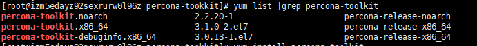
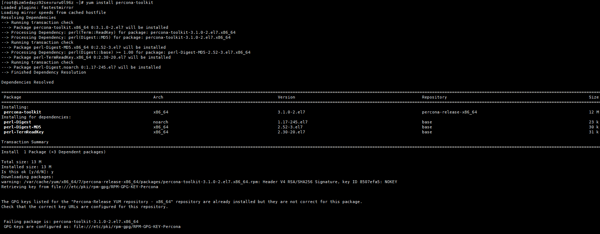
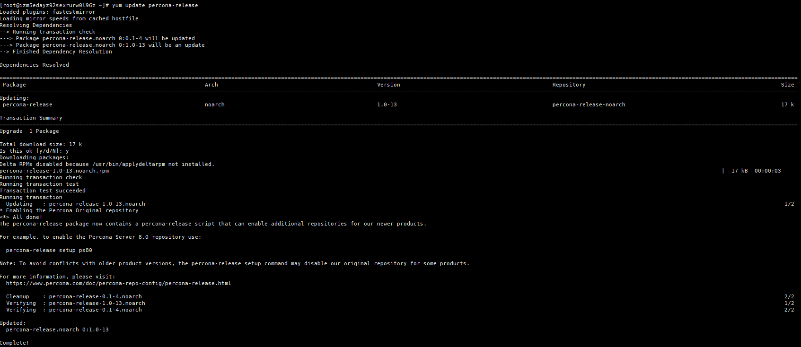
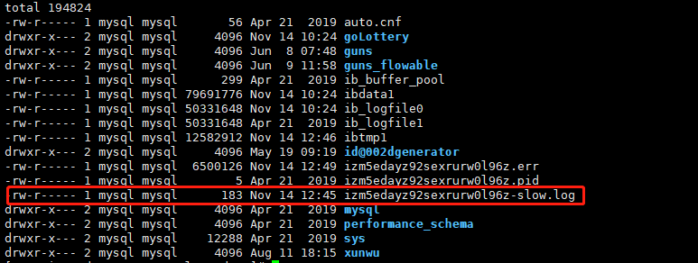
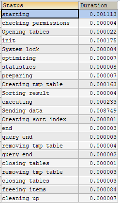
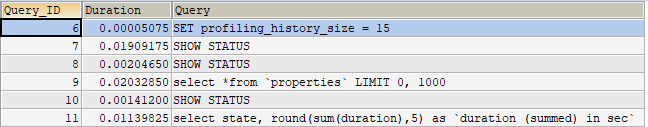

# 补充
1. 安装 percona-toolkit
 
2. 下载percona-toolkit安装包yum install https://www.percona.com/downloads/percona-toolkit/3.1.0/binary/redhat/7/x86_64/percona-toolkit-3.1.0-2.el7.x86_64.rpm
 
3. 查看可用的安装包yum list |grep percona-toolkit

4. 安装percona-toolkit: yum install percona-toolkit
安装的过程如果发生了如下的提示    

需要执行以下的命令进行更新

使用percona-toolkit分析慢查询日志:

首先mysql需要开启慢查询日志,可以使用下面的语句:
    
        SET GLOBAL slow_query_log = ON; 

开启了慢查询日志之后就会得到如下的一个慢查询的日志:

 
 
 
 
 

# 服务器性能剖析

* 优化的原则

1. 确定优化要达到什么目的

2. 有效的测量才能进行有效的优化

## 通过性能测试剖此进行优化

要掌握并实现面向响应实现的优化方法，需要不断的对系统进行性能剖析，性能剖析是测量和分析实现花费在那里的主要方法，主要需要进行两部任务：

1. 测量任务所花费的时间
2. 对测试结果进行统计和排序

### 理解性能的剖析

1. 值得优化的查询

2. 异常情况

3. 未知的未知

4. 被掩藏的细节

#### 剖析应用的性能

虽然是MySQL的优化，但是对系统性能的优化还是以自上而下的方式好，
而且优化应用服务的性能比优化MySQL服务的性能来的更加快,应用服务需要考虑的影响因素：

* 外部资源，比如调用外部的WEB服务或者搜索引擎。

* 应用需要处理大量的数据，比如分析一个超大的XM文件

* 再循环中执行昂贵的操作，滥用正则表达式

* 使用了低效的算法。

#### 剖析MySQL查询

确定了上层应用的性能瓶颈之后可以往下钻取，可以对查询进行单独的分析

1. 捕获MySQL的查询到日志文件中

2. 分析日志

#### 剖析单条查询

1. 使用 SHOW PROFILE

    SHOW PROFILES;

2. SHOW STATUS

MySQL的SHOW STATUS命令返回一些计数器.既有服务器级别的全局计数器，也有基于某个链接的会话级别的计数器。
SHOW STATUS并不是一款剖析的工具。可以显示某些活动如度索引的频繁程度，但是无法给舒消耗了多少时间。最有
用的是句柄计数器(handler counter),临时文件按和表计数器等。

3.使用Explain+慢SQL分析

* id
 SELECT查询的序列号，包含一组数字，标识查询中执行的SELECT语句或操作表的顺序
 主要包含三种情况
 1. id相同，执行顺序由上而下
 2. id不相同，如果子查询，id会递增，id值越高，约先被执行
 3. id既相同又有不相同。id如果相同认为是一组，执行顺序由上而下；所有组中，id的值越大优先级越改，越先被执行。
 
 
 
 * select_type
 
 SIMPLE:简单SELECT查询，查询中不包含子查询或者UNION
 PRIMARY:查询中包含任何复杂的字部分，最外层的查询
 SUBQUERY:select或者where包含的子查询部分。
 DERIVERD:from中包含的的子查询被标记为DERIVER(衍生),MySQL会递归执行这些子查询，把结果放到临时表.
 UNION:若第二个SELECT出现UNION，则被标记为UNION，若UNION包含FROM子句的子查询中，外层子查询被标记为DERIVED
 UNION_RESULT:从UNION表获取结果的SELECT
 
 
 
 * table
 
 显示一行数据是关于哪张表的。
 
 
 
 
 * type
 
 
 type是显示i访问类型，是较为重要的一个指标，结果值嘴还到最坏依次是：
 
 system>const>eq_ref>ref>fulltext>ref_or_null>index_merge>unique_subquery>rang>index>ALL
 一般来说查询要达到range级别，最白达到ref
 
    1. system：表只有一行记录（等于系统表），这是const类型的特例，平时不会出现
    2. const：如果通过索引依次就找到了，const用于比较主键索引或者unique索引。 因为只能匹配一行数据，所以很快。如果将主键置于where列表中，MySQL就能将该查询转换为一个常量
    3. eq_ref：唯一性索引扫描，对于每个索引键，表中只有一条记录与之匹配。常见于主键或唯一索引扫描
    4. ref：非唯一性索引扫描，返回匹配某个单独值的所有行。本质上也是一种索引访问，它返回所有匹配 某个单独值的行，然而它可能会找到多个符合条件的行，所以它应该属于查找和扫描的混合体
    5. range：只检索给定范围的行，使用一个索引来选择行。key列显示使用了哪个索引，一般就是在你的where语句中出现between、<、>、in等的查询，这种范围扫描索引比全表扫描要好，因为只需要开始于缩印的某一点，而结束于另一点，不用扫描全部索引
    6. all：Full Table Scan，遍历全表获得匹配的行
 
 
 
 * key
 
     实际使用的索引。如果为NULL，则没有使用索引。 
     查询中若出现了覆盖索引，则该索引仅出现在key列表中。
 
 
 * key_len
 
     
     表示索引中使用的字节数，可通过该列计算查询中使用的索引的长度。在不损失精度的情况下，长度越短越好。
     key_len显示的值为索引字段的最大可能长度，并非实际使用长度，即key_len是根据表定义计算而得，不是通过表内检索出的。
     
     
 * ref
 
       
      显示索引的哪一列被使用了，哪些列或常量被用于查找索引列上的值。

 
 * rows
 
        
        根据表统计信息及索引选用情况，大致估算出找到所需记录多需要读取的行数。
 
 
 
 
 
 
* Extra

    包含不适合在其他列中显示但十分重要的额外信息：
    1、Using filesort： 说明MySQL会对数据使用一个外部的索引排序，而不是按照表内的索引顺序进行读取。MySQL中无法利用索引完成的排序操作称为“文件排序”
    2、Using temporary：  使用了临时表保存中间结果，MySQL在对查询结果排序时使用临时表。常见于排序order by和分组查询group by
    3、Using index： 表示相应的SELECT操作中使用了覆盖索引（Covering Index），避免访问了表的数据行，效率不错。 如果同时出现using where，表明索引被用来执行索引键值的查找； 如果没有同时出现using where，表明索引用来读取数据而非执行查找动作 覆盖索引（Covering Index）： 理解方式1：SELECT的数据列只需要从索引中就能读取到，不需要读取数据行，MySQL可以利用索引返回SELECT列表中 的字段，而不必根据索引再次读取数据文件，换句话说查询列要被所建的索引覆盖 理解方式2：索引是高效找到行的一个方法，但是一般数据库也能使用索引找到一个列的数据，因此他不必读取整个行。 毕竟索引叶子节点存储了他们索引的数据；当能通过读取索引就可以得到想要的数据，那就不需要读取行了，一个索引 包含了（覆盖）满足查询结果的数据就叫做覆盖索引 注意： 如果要使用覆盖索引，一定要注意SELECT列表中只取出需要的列，不可SELECT *, 因为如果所有字段一起做索引会导致索引文件过大查询性能下降
    6、impossible where： WHERE子句的值总是false，不能用来获取任何元组
    7、select tables optimized away： 在没有GROUP BY子句的情况下基于索引优化MIN/MAX操作或者对于MyISAM存储引擎优化COUNT(*)操作， 不必等到执行阶段再进行计算，查询执行计划生成的阶段即完成优化
    8、distinct： 优化distinct操作，在找到第一匹配的元祖后即停止找同样值的操作

