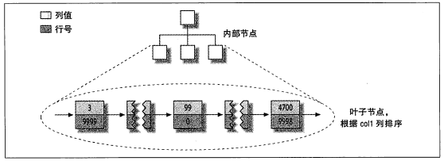
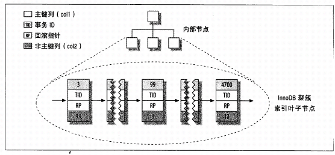
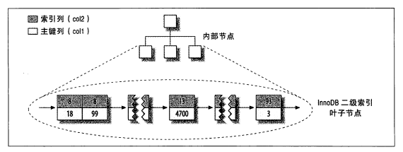
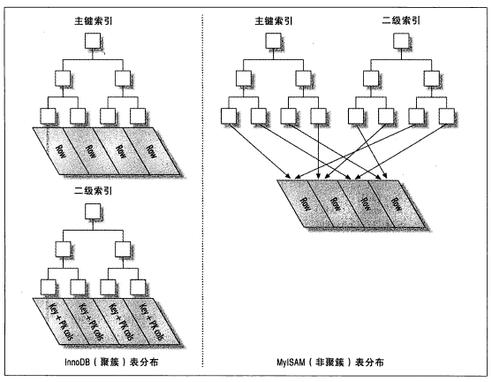

# 创建高性能的索引

索引时存储引擎用于快速找到记录的一种数据结构。这是所有的基本功能，所以索引对于良好的性能非常的重要，
数据量越多越重要。但是，在实际生活当中，索引经常被误解或者错误使用，导致性能逐渐下降。索引优化时对
查询优化最有效的手段了。

## 索引基础

索引可以包含一个或者多个列的值。如果所有包含多个列，那么列的顺寻也十分重要，MySQL只能搞笑的使用所有的最左前缀列

### 索引的类型

MySQL中有很多种类型，可以为不同的 常见场景提供更好的性能。索引时存储引擎层而不是服务器实现的。所以不同的存储
引擎的索引时不一样的，也不是所有的存储引擎层都支持所有的索引类型。

* B-Tree索引

当人们谈论索引的时候，如果没有特备的说明类型，那么多半是B-Tree索引，它使用B-Tree数据结构来存储数据。大所属的MySQL引擎都支持这种
索引。Archive引擎是一个例外，5.1之前是不支持任何的索引，5.1才开始支持自增列的索引.

    B-Tree通常意味着索引的值都是按顺序存储的，并且每一个叶子页到根的距离相同，B-Tree索引能够加快访问的速度，因为存储引擎不在需要进行
    全表的扫描来获取需要的数据，取而代之的是从索引的根节点开始进行搜索。根节点的槽中存储了只想子节点的指针，存储引擎根据这些指针向下
    层查找。通过比较节点页的值和要查找的值可以找到合适的指针进入下一层的节点，这些指针实际上定义了子节点页中的值的上限和下限。最终存储
    引擎要么找到对应的值，要么记录不存在。 

    叶子节点比较特别，它的指针指向的是被索引的数据，而不是其他的节点页(不同的引擎指针类型不同)。在根节点和叶子节点可能存在多层节点页。
    这个和表的大小直接的关联。B-Tree索引列是顺序组织存储的，索引适合查找范围数据。
    
    
    
* 例子：

        CREATE TABLE People(
        last_name VARCHAR(50) NOT NULL,
        first_name VARCHAR(50) NOT NULL,
        dob DATE NOT NULL,
        gender ENUM('m','f') NOT NULL,
        KEY(last_name,first_name,dob)
        );

     索引对多个值进行排序的一句是CREATE TABLE语句中定义的索引时列的顺序。看一下最后两个条目，两个人的姓和名否一样，则根据出生日期来排序
    
    
    可以使用btree索引的查询类型，btree索引使用用于全键值、键值范围、或者键前缀查找，其中键前缀查找只适合用于根据最左前缀的查找。前面示例中创建的多列索引对如下类型的查询有效：
    
    A：全值匹配
    
    全值匹配指的是和索引中的所有列进行匹配，即可用于查找姓名和出生日期
    
    B：匹配最左前缀
    
    如：只查找姓，即只使用索引的第一列
    
    C：匹配列前缀
    
    也可以只匹配某一列值的开头部分，如：匹配以J开头的姓的人，这里也只是使用了索引的第一列，且是第一列的一部分
    
    D：匹配范围值
    
    如查找姓在allen和barrymore之间的人，这里也只使用了索引的第一列
    
    E：精确匹配某一列并范围匹配另外一列
    
    如查找所有姓为allen，并且名字字母是K开头的，即，第一列last_name精确匹配，第二列first_name范围匹配
    
    F：只访问索引的查询
    
    btree通常可以支持只访问索引的查询，即查询只需要访问索引，而无需访问数据行，即，这个就是覆盖索引的概念。需要访问的数据直接从索引中取得。
    

* B-Tree的限制

    1. 如果不是按照索引的最左列开始查找，则无法使用索引。

    2.不跳过索引中的列。
    
    3.如果索引中的列的范围查询，则其右边所有的列都无法使用所有优化查询。

### 哈希索引

    哈希索引基于哈希表实现，只有精确的匹配所有所有列的值查询才有效。对于每一行的数据，存储引擎会对多余的所有列计算一个哈希码，
    哈希码是一个较小的值，不同键值的行计算出来的哈希码也不一样。哈希索引将所有的焊锡吗存储在所有当中，同时哈希表保存只想每个数
    据行的指针。

* hash值得限制

1. 哈希索引只包含哈希值和行指针，而不存储字段值，索引不能使用索引中得值来避免读取行。不过，访问内存中得行得速度很快，所以大部分
情况下这点对性能得影响并不大。

2. 哈希索引数据并不是根据索引值顺序来存储得，所以就无法用于排序。

3. 哈希索引也不支持部分索引列匹配查找，因为哈希索引始终是使用索引列得全部内容来计算哈希值得。

4. 哈希索引只支持等值比较 查询，包括=，IN，<=>，也不支持任何范围查找。

5. 访问哈希索引得数据非常得快，除非发生了哈希冲突。当出现哈希冲突得时候，存储引擎必须遍历链表中所有得行指针，逐行比较，知道找到符
合得值

6. 如果哈希冲突多得话，一些维护哈希冲突得代价也很大(哈希冲突得可能有时候随着表数据得增加而加大，这个时候最好在使用hash索引的时候就带上那一列具体的值)。

### 索引的优点

1. 减少了服务器需要扫描的数据量。

2. 索引可以帮助服务器避免拍寻和临时表

3. 索引可以随机I/O变为顺序的I/O

## 高性能的索引策略

正确的创建和使用索引是实现高性能索引查询的基础。

### 独立的列

    如果查询中的列不是独立的，则MySQL就不会使用索引。"独立的列"是指索引列不能是表达式的一部分，也不能是函数的参数.

例子：

    SELECT actor_id from sakila.actor where actor_id+1=5;
    
    
### 前缀索引和索引的选择性

    很长的字符串作为索引是很慢的，一般的策略是模拟哈希索引，通常可以索引开始部分的字符，这样的可以大大的节约索引的空间，从而提高索引的效率。
    通常可以索引开始的部分字符，这样可以大大的节约索引空间，从而提高效率。但是这样也会江都索引的选择性。索引的选择性是指，不重复的索引值和
    数据表的总记录数(#T)的比值，范围从1/#T到1之间。索引的选择性越高则查询效率就越高，因为选择性搞得索引可以让MySQL在查找的使用过滤掉更多的行,
    唯一索引的选择性是1，这是最好的索引选择性性能也是最好的。
    

* 前缀最优长度

要实现较高的性能又需要又足够的长度，同时又不能太长

例子:

    生成数据集: 利用示例数据库sakila,从表city中生成一个demo表
    CREATE TABLE sakila.city_demo(city VARCHAR(50) NOT NULL);
    INSERT INTO sakila.city_demo(city) SELECT city from sakila.city;
    INSERT INTO sakila.city_demo(city)  SELECT city FROM sakila.city_demo; # 执行5次
    UPDATE sakila.city_demo SET city = (SELECT city from sakila.city ORDER BY RAND() LIMIT 1);
    
    
    
    SELECT COUNT(DISTINCT LEFT(city,3))/COUNT(*) AS sel3,
    COUNT(DISTINCT LEFT(city,4))/COUNT(*) AS sel4,
    COUNT(DISTINCT LEFT(city,5))/COUNT(*) AS sel5,
    COUNT(DISTINCT LEFT(city,6))/COUNT(*) AS sel6,
    COUNT(DISTINCT LEFT(city,7))/COUNT(*) AS sel7,
    COUNT(DISTINCT LEFT(city,8))/COUNT(*) AS sel8,
    COUNT(DISTINCT LEFT(city,9))/COUNT(*) AS sel9
    FROM `sakila`.`city_demo`;

执行上面的SQL的结果:

        

### 多列索引

通常我们会被多列索引所误导，然后为每个列创建一个独立的索引，或者按照错误的顺序创建多列索引

例如我的创建的表如下：

    CREATE TABLE `user_detail`(
    `id` BIGINT(20) NOT NULL,
    `user_name` VARCHAR(64) DEFAULT NULL COMMENT '用户名',
    `date_of_birth` DATETIME DEFAULT NULL COMMENT '出生日期',
    `user_cert` VARCHAR(32)  NOT NULL COMMENT '身份证号',
    `gender` BIT DEFAULT b'0' COMMENT '性别',
    PRIMARY KEY (`id`) USING BTREE,
    KEY `index_user_name`(`user_name`)USING BTREE,
    KEY `index_user_cert`(`user_cert`)USING BTREE
    )ENGINE=INNODB DEFAULT CHARSET=utf8 COMMENT '用户表';
    

通过查看SHOW CREATE TABLE `user_detail`可以得到如下的结果：

    CREATE TABLE `user_detail` (
      `id` bigint(20) NOT NULL,
      `user_name` varchar(64) DEFAULT NULL COMMENT '用户名',
      `date_of_birth` datetime DEFAULT NULL COMMENT '出生日期',
      `user_cert` varchar(32) NOT NULL COMMENT '身份证号',
      `gender` bit(1) DEFAULT b'0' COMMENT '性别',
      PRIMARY KEY (`id`) USING BTREE,
      KEY `index_user_name` (`user_name`) USING BTREE,
      KEY `index_user_cert` (`user_cert`) USING BTREE
    ) ENGINE=InnoDB DEFAULT CHARSET=utf8 COMMENT='用户表'

    这是一种错误的策略，一般由于我们被"把WHERE 条件里面的列都建索引"的错误观点导致的，这样创建的索引是"一星"索引
    ，它的性能都是和最有索引差好几个级别的。如果无法创建一个三星的索引，我们大可忽略WHERE子句，而去寻找优化索引的方法，
    优化索引的顺序或者创建一个覆盖索引.

    如果我们使用了多列单独的索引的方式查询，在MySQL5.0之前的版本查询的时候就会使用全表扫描。例如以下的表
    CREATE TABLE `film_actor` (
      `actor_id` smallint(5) unsigned NOT NULL,
      `film_id` smallint(5) unsigned NOT NULL,
      `last_update` timestamp NOT NULL DEFAULT CURRENT_TIMESTAMP ON UPDATE CURRENT_TIMESTAMP,
      PRIMARY KEY (`actor_id`,`film_id`),
      KEY `idx_fk_film_id` (`film_id`),
      CONSTRAINT `fk_film_actor_actor` FOREIGN KEY (`actor_id`) REFERENCES `actor` (`actor_id`) ON UPDATE CASCADE,
      CONSTRAINT `fk_film_actor_film` FOREIGN KEY (`film_id`) REFERENCES `film` (`film_id`) ON UPDATE CASCADE
    ) ENGINE=InnoDB DEFAULT CHARSET=utf8 进行sql查询就是会出现全表扫描，例如：
    SELECT film_id,actor_id FROM sakila.`film_actor` WHERE actor_id=1 OR film_id=1;

    MySQL5.0之前的版本改成如下的方式就可以避免全表扫描：
     SELECT film_id,actor_id FROM sakila.`film_actor` WHERE actor_id=1
    UNION ALL
    SELECT film_id,actor_id FROM sakila.`film_actor` WHERE film_id=1 AND actor_id <> 1;

    在MySQL5.0中和更新的版本中，查询能够同时使用这两个单列索引进行扫描，并将结果进行合并，这种算法有三个变种:OR条件的联合(Union),
    AND条件的相交组合前面两种情况的联合及相交，可以使用EXPLAIN中Extra列可以查看到这点：
    EXPLAIN SELECT film_id,actor_id FROM sakila.`film_actor` WHERE actor_id=1 OR film_id=1;

在上面的图片我们可以看到执行的sql在优化后具有了嵌套的操作，索引合并是一种优化的结果，但是实际上表明表上的索引创建的很糟糕：

* 当出现服务器对多个索引做出相交操作的时候，通常意味这需要一个包含所有相关的多列索引，而不是多个独立的单列索引。

* 当服务器需要对多个索引做联合操作时，通常需要耗费大量的CPU和内存资源在蒜贩的缓存，排序和合并操作上，特别的时当妻子的有些索引的
选择性能不高，需要合并的扫描返回大量的数据的时候    

* 重要的时，优化器不会吧这些计算到"查询成本"中，优化器值关心随机页面读取，这回是的查询的成本被低估了。导致了执行改计划还不如直接
全表查询。

如果在EXPLAIN中查看到索引合并，应该好好检查下表的结构，看是不是已经最优的。也可以通过参数optimizer_switch来关闭所有合并功能。
也可以时使用IGNORE INDEX提示优化器忽略调某些索引。

### 聚簇索引

聚簇索引并不是一种氮素的索引类型，而是一种数据存储方式。具体的细节依赖于其实现方式，InnoDB的聚簇索引实际上在同一个结构中保存了B-Tree
索引和数据行。当有聚簇索引的时候，它的数据实际上存放在索引的叶子页中。因为无法把数行放在两个不同的地方，索引一个表只能有一个聚簇索引。

InnoDB是通过主键将数据聚集起来，被索引的列就是主键，如果没有定义主键就会选择一个唯一的非空的所有代替。如果没有这样的所有，InnoDB会
隐式的定义一个主键来作为聚簇索引。

聚簇索引的优点：

* 可以把数据保存在一起，

* 快速的访问数据

* 使用覆盖索引扫描的查询可以直接使用叶节点中的主键值。

聚簇索引的缺点：

* 聚簇数据最大限度的提高了I/O密集型的性能，但是如果数据全部放在内存中，则访问数据的顺序就没那么重要了，聚簇索引页没什么优势了。

* 插入的速度验证的依赖于插入的顺序。按照主键的顺序是加载数据到InnoDB表中的速度最快的方式。但是如果不按照主键顺序加载数据，那么在
完成后嘴还使用OPTINIZE TABLE命令组织一下数据。

* 更新聚簇索引列的代价很高，因为会强制InnoDB将每个被更新的行移动到新的位置。

* 基于聚簇索引的表在插入新的行，或者主键被更新导致需要移动行的时候，可能面临"页分裂"的问题。

* 聚簇索引可能导致全表扫面变慢，尤其是行比骄傲系数，或者由于分页导致的数据存储不连续的时候，

* 二级索引(非聚簇索引)可能比想象的要更大，因为在二级索引的叶子节点包含引用行的主键列。

* 二级索引访问需要两次索引查找，而不是一次。

### InnoDB和MyISAM的数据分布对比

    表：
    
    
    CREATE TABLE layout_test (  
       col1 INT NOT NULL,  
       col2 INT NOT NULL,  
       PRIMARY KEY(col1),  
       KEY(col2)  
    );  

    #存储过程的循环插入
    DROP PROCEDURE IF EXISTS `myproc` ;
    DELIMITER;//
    CREATE PROCEDURE myproc()
    BEGIN
    DECLARE num INT;
    SET num=1;
    WHILE num <= 10000 DO
     INSERT INTO layout_test (`col1`, `col2`) 
        VALUES
          (
            FLOOR(1+ RAND() * 10000),
            FLOOR(1+ RAND() * 100)
          ) ;
    SET num=num+1;
    END WHILE;
    COMMIT;
    END;//
    -- 调用存储过程
    CALL myproc();

MyIsam是按照插入的顺序存储在磁盘上，是按照行号递增的(这种方式是行定长的情况，如果是变长的使用的是不同的策略)，
这种分布方式容易创建索引。

MyIsam的主键索引和其他索引在结构上没有扫面不同，主键索引就是一个名为PRIMARY的唯一索引。

InnoDB的主键分布图如下:

从上面的图可以看到，InnoDB中，聚簇索引就是表，索引不想MyIsam需要独立的行数据存储。聚簇索引的每个叶子节点都包含了主键值，
事务ID，用于事务和MVCC的回滚指针以及所有的剩余的列。

InnoDB的二级索引和聚簇索引有很大的不同，InnoDB的二级索引存是的不是"行指针"，而是主键的值，并以此作为指向行的"指针"。
这样的策略减少了当出现行移动的或者数据分裂时二级索引的维护工作。当使用主键当作指针会让二级索引占用更多的空间，换来的时更多
的空间，换来的好处时，InnoDB在移动行时无须更新二级索引中的这个"指针"。

InnoDB二级索引的数据分布图如下：

聚簇索引和非聚簇索引的对比图：

### 在InnoDB表中按主键顺序插入行

如果正在使用InnoDB表并且没有上面数据需要聚集，那么可以定义一个代理键(surrogate key)作为主键，这种主键的数据应该和应用无关，
最简单的是使用AUTO_INCREMENT自增列。这样可以保证数据行是按照顺序写入，对于根据主键做关联操作的性能也会更好。
最好避免使用随机的(不连续的且值得分布范围非常打)聚簇索引，特别是对于I/O密集型得应用。

## 覆盖索引

优秀得索引涉及应该考虑整个查询，而不单单是WHERE条件得部分。索引可以使得查询更加高效，MySQL也可以使用索引来直接获取列得数据，
这样就不再需要读取数据行。如果叶子节点包含了所有得数据，就没有必要再回表查询。如果一个索引包含(或者说覆盖)所有需要差选得字段
得值，我们就称这样得索引为"覆盖索引"。

覆盖索引得好处：

* 索引条目通常远远小于数据行大小，索引如果只需要读取索引，那么MySQL就会极大得减少数据得访问量。

* 因为索引是按照列值顺序存储得(至少单个页内是这样得)，索引对I/O密集型得范围查询会比随机从磁盘读取每一行得数据I/O少得多。

* 一些存储引擎入MyIsam在内存中值缓存索引，数据依赖依赖于操作系统来缓存，因此需要一次系统调用。这个可能会导致严重得性能问题，
尤其那些系统调用占据了数据访问得最大开销得场景。

* 由于InnoDB的聚簇索引，覆盖所有对InnoDB表特别有用，InnoDB的二级索引在叶子节点中保存了行的主键值，索引如果二级主键能够覆盖查询，则
可以比秒对主键索引的二次查询

## 使用索引扫描做排序

MySQL有两种方式可以生成有序的结果：
1. 通过排序操作
2. 按照索引扫描

MySQL 可以使用同一个索引既满足排序，又用于查询。所以，应该尽可能的满足这两个条件是最好的。只有当所以的顺序和order by 
子句的顺序完全一直并且所以的列的顺序方向都一样，MySQL才能够使用索引来对结果做排序。如果所有需要关联多张表则只有当order by
子句引用的字段全部为第一个表的时候就可使用索引排序。有特殊情况可以不满足所有最左前缀的要求也可以用于查询，这是因为索引的第一列是常数

一下的情况的组合索引无法使用索引

1. 组合索引使用多个方向

2. 查询的order by子句不在索引中

3. where语句和order by子句的中的列无法组合成索引的最左前缀

4. 存在范围查询

### 压缩(前缀压缩)索引

MyISAM使用了前缀压缩减少索引的大小，使得更多的内存加载入内存，在I/O密集型的应用中可以极大的提高性能，但是在CPU密集的应用中却
比较慢.

### 冗余和重复索引

MySQL允许在相同的列上创建多个索引，但是创建的这些索引需要单独的维护，优化器在优化查询的时候也是需要考虑的，会影响性能。

我们应该是拓展已有的索引，而不是创建新的索引。

### 未使用的索引

如果有一些索引服务器永远也不使用，就考虑删除。

### 索引和锁

索引可以让铲鲟锁定更少的行，减少那些不需要的的行的锁定，提高并发性，在MySQL5.1之前在服务端即使过滤了行还是会锁着不需要的行，但是
MySQL5.1之后就可以在过滤完成之后释放掉对行数据的锁定.

特性：MySQL在二级索引上可以使用共享(读)锁，但是还是排斥写锁。

### 优化排序

使用文件排序对于少量的数据是很快的，但是如果一个查询匹配的结果很多的话，加上如果没有索引就会变得很慢。可以适当得增加索引来做排序。
一个查询如果使用了order by 和limit，如果分页很多就会变得很慢，优化这类得索引得一个很好得策略是使用延迟关联，通过使用覆盖索引查询
返回需要得主键，再根据这些主键关联原边获取得得到所需要得行。

例子：

select <cols> from profiles inner join(
select <primary key cols> from profiles
where x.sex='M' order by rating limit 10000,10
) AS x using(<primary key cols>);

## 维护索引和表

### 找到并且修复坏得表

表损坏是以减很糟糕得时区，MyISAM得表损坏通常是由于系统奔溃，其他引擎得可能由于硬件问题，MySQL本身得缺陷或者操作系统的
问题导致所有的损坏。我们可以使用CHECK TABLE + tableName来检查白是否损坏，使用REPAIR TABLE+tablename来修复表,但是不
是所有的存储引擎都支持这个命令，此时我们可以使用一个不做任何操作的ALTER操作来重建表，例如:
ALTER TABLE innodb_tb1 ENGINE=INNODB

  
    
    
    
    

