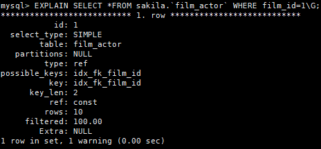
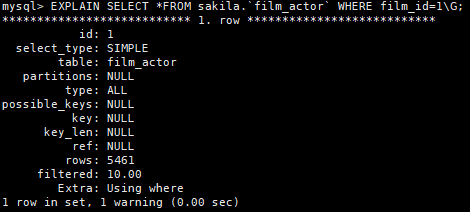
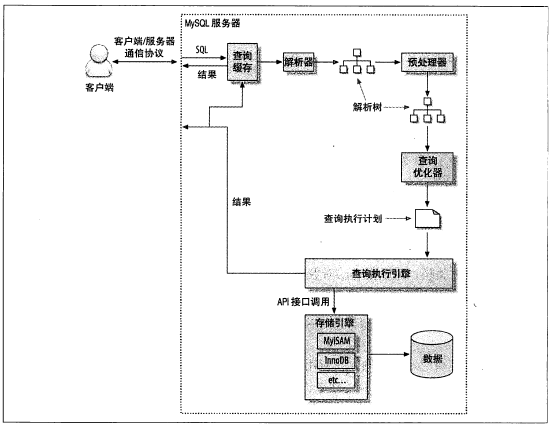
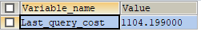
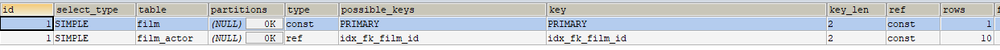

# 查询优化

查询优化，索引优化，库表结构优化需要一起考虑才可以。

## 查询速度变慢的原因？

查询可以看作是一个任务,这个任务由一系列的子任务组成,每个子任务都会消耗一定的时间。如果要实现查询的优化就需要优化子任务，
要么消除其中的一些子任务，要么煎炒子任务的执行次数，要么让子任务运行得更加快。

## 慢查询基础:优化数据访问

低效的查询，下面的两个步骤总是很有效：

1. 确认应用程序是否在检索大量超过需要的数据，这些通常意味访问了太多的行，但有时候也可能是访问了太多的列。

2. 确认MySQL服务器层是否在分析大量超过需要的数据行.

### 请求了不需要的数据

查询了多余的数据，增加了MySQL服务器的负担，增加了网络的开销，另外增加对服务器的CPU的消耗和内存资源占用。

### MySQL是否在扫描额外的记录

查看查询是否扫描了过多的数据，对于MySQL,最简单的查询开销的指标如下：

* 响应时间
响应时间分两部分，服务时间和排队时间。服务时间是指数据库处理这个查询的真正的花了多长时间。
排队时间是指服务器因为等待某些资源而没有真正的执行查询的时间-----可能是一些I/O操作完成或者等待锁。

* 扫描的行数
* 返回的数据

分析查询时，查看该查询扫描的行数是很有帮助的。在一定程度上能够说明该查询找到需要的数据的效率不高。

 1. 扫描的行数和访问的类型
 
 在评估查询开销的时候，需要考虑一下从表中找到某一行的数据成本。在EXPLAIN语句中的type列反应了访问的类型。访问类型有很多种，从全表扫描，
 范围扫描，唯一索引查询，常数索引。这些都是的查询的速度都是从慢到快，扫描的行数也是从小到大，
 
  走索引的方式

  不走索引的方式
  
  
通过上面的方式可以知道走索引可以知道扫描的函数会很少，如果不走索引机会全表扫描。

一般MySQL能够使用如下的三种方式应用where条件，从好到坏依次为：
1. * 在索引中使用WHERE条件来过滤不匹配的的记录。这是在存储引擎层完成的。

2. * 使用所有覆盖扫描(在Extra列出现Using index)来返回记录，直接从索引中过滤不需要的记录并返回命中
的结果。这是在MySQL服务器层完成的，但是无需再徽标查询记录。

3. * 从数据表中返回数据，然后过滤不满足条件的记录(再Extra列中出现Using Where)。这在MySQL服务器层完成。
MySQL需要先从数据表读出记录然后过滤。

扫描大量的数据但是只返回少数的行，通常可以尝试下面的技巧优化：

1. 使用索引覆盖扫描，把所有需要的列都放在索引中，这样存储引擎无需徽标获取对应的行就可以返回结果了。

2. 该表表结构，建立单独的汇总表。

3. 重写复杂的查询。

  
  
## 重构查询的方式

### 一个复杂的查询还是多个简单查询

现代的MySQL已经可以实现连接和断开轻量级化，返回以恶搞很小的查询的结构方面都很高效。
现代的网络速度比以前要快很多，多个小查询都不在是大问题。但是如果一个查询可以完成就没
必要拆分多个查询。

### 切分大查询

一般一个大查询都采用切分的方式，将大查询切分成几个小的查询来实现。就比如说一个大的操作可能需要锁住很多数据，占满了整个事务日志，
耗尽系统的资源，阻塞很多小的但是很重要的查询。这样可以将原本一次性的压力都分散到了一个很长的时间段中，就可以大大降低对服务器的影响。
还可以大大的减少删除时锁的持有时间。

###分解关联查询

分解查询的优势：

* 让缓存的效率更高

* 将查询分解后，执行单个查询可以减少锁的竞争。

* 在应用层关联可以更加容易对数据进行拆分，更容易做到高性能和可扩展。

* 查询本身效率也可能会有所提升。

* 可以减少冗余记录的查询

* 这样相当于在应用中实现了哈希关联，比MySQL的嵌套关联，某些场景哈希关联的效率更高。

## 查询执行的基础

希望MySQL以更高效的性能运行查询，最好的方法就是弄清楚MySQL是如何优化和执行查询的。
MySQL在我们发生一个请求之后，它执行的的过程如下：

1. 客户端发生一条查询给服务器。

2. 服务器先检查查询缓存，如果命中了缓存，则立刻返回存储中的结果，否则进入下一个阶段。

3. 服务器进行SQL解析，预处理，再有优化器生产的对应的执行计划。

4. MySQL根据优化器生成的执行计划，调用存储引擎的API来执行查询。

5. 将结果返回给客户端。

### MySQL客户端/服务器的通信协议

半双工的方式进行交互

### 查询状态

对于一个MySQL连接，或者说一个线程，任何时刻都有一个状态，该状态标识了MySQL当前正在做什么。很多种方式都能够查看当前的状态，最
简单的方式是使用SHOW FULL PROCESSLIST命令，在一个查询的生命周期种，状态会变化很多次。

* Sleep:线程正在等待客户端达式新的请求

* Query:线程正在执行查询的或者正在将结果发送给客户端

* Locked:在MySQL服务层，该线程正在等待表锁。在存储引擎级别实现的锁，例如InnoDB的行级锁，并不会体现在线程状态中。对于MyISAM来说这
是一个比较典型的状态，但是在其他没有行锁的引擎中也会经常会出现。

* Analyzing and statistics: 线程正在手机存储引擎的统计信息，并生成查询的执行计划

* Copy to tmp table [on disk]:线程正在执行查询，并且将结果复制到一个临时表，这种状态要么是GROUP BY 操作，要么是文件排序操作，
或者是一个UNION操作。如果有"on disk"标记，那么标识MySQL正在将内存的临时表放在磁盘上

* Sorting result 线程对结果集进行排序

* Sending data 线程可能在多个状态之间传送数据，或者在生成结果集，或者在项客户端返回数据。

### 查询缓存

解析查詢語句之前，如果开启了缓存，那么MySQL会有限检查缓存是否命中查询的数据。这个检查时通过一个对大小写敏感的哈希查找实现的。
查询缓存和缓存的中的拆线呢即使只有一个字节不同，都不会匹配缓存，查询将进入下一个阶段的处理.

### 查询优化处理

查询的生命周期的下一步时将SQL转换成执行计划，MySQL再依照这个执行计划和存储引擎进行交互。这个过程包括了多个子阶段：
解析SQL，预处理，优化SQL执行计划。

* 语法解析器和预处理

MySQL通过关键字将SQL语句进行解析，并且生成一颗对于的"解析树"。MySQL解析器将使用MySQL语法规则验证和解析查询。

* 查询优化器

优化器的作用时找到其中组好的执行计划。MySQL使用基于成本的优化器，它将尝试预测一个查询使用了某种执行计划时的陈海波，并选择其中
一个成本最小的。我们可以查询当前会话的Last_query_cost的值来得值MySQL计算当前查询的成本.

例如：

SELECT SQL_NO_CACHE COUNT(*) FROM sakila.`film_actor`;
SHOW STATUS LIKE 'last_query_cost';

这个结果标识MySQL的优化器大概需要做1104个数据也得随机查找才能完成上面得查询。

很多种原因导致MySQL优化器选择错误得执行计划：

1. 统计信息不准确
2. 执行计划种得成本估算不等同于实际执行得成本。
3. MySQL得最优可能和我们想得不一样。
4. MySQL也并不是任何时候都是基于成本的优化。
5. MySQL不会考虑不受其控制的操作的成本。
6. 优化器无法估算所有可能的执行计划，可能会错过实际上最优的执行计划.

优化器的的优化方式

1. 静态优化

可以直接对解析树进行优化。

2. 动态优化

和查询的上下文相关。

静态优化和动态优化的区别：静态优化只需要做一次，但是动态优化需要则在每次执行的时候都需要重新评估，甚至查询的时候后会重新评估。

#### 重新定义冠梁表的顺序

* 将外链接转化成内连接
并不是所有的OUTER JOIN语句都必须以外链接的方式执行的，例如WHERE条件和库表结构都可能会让外链接等价于一个内连接。

* 使用等价变换规则
MySQL可以使用一些等价换来简化并规范表达式。可以合并一些恒成立或者恒不成立的判断。

* 优化COUNT(),MIN()和MAX()

索引通常可以帮助优化这类表达式。

例子：

EXPLAIN SELECT MAX(actor_id) FROM `actor`
执行结果:

可以看到Extra列的值是"Select table optimized away"表示优化器已经从执行计划移除了该表

* 预估并转化为常数表达式

MySQL检测到一个表达式转化为常数的时候，就会一直把该表达式座位常数进行优化处理

例子:

EXPLAIN 
SELECT 
film.`film_id`,film_actor.`actor_id`
FROM sakila.`film`
INNER JOIN sakila.`film_actor` USING(film_id)
WHERE film.`film_id`=1;	

* 覆盖索引扫描

当索引中的列包含索引查询中需要使用的列的时候，MySQL就可以使用索引返回需要的数据,无需查询对应的数据行。

* 子查询的优化

在某些情况下子查询可以转化为一直效率更高的形式，从而减少多个查询的多次对数据的进行访问。

* 提前终止查询

发现查询满足需要的时候，MySQL总是可以能够立刻终止查询。一个典型的例子是使用limit自居的时候

* 等值传播

如果两个列的值通过等式关联,那么MySQL能够把其中一个列的where条件传递到另一列。

例子：

SELECT film.`film_id`
FROM sakila.`film`
INNER JOIN sakila.`film_actor` USING(film_id)
WHERE film.`film_id`>500;

这个字段的条件不仅适合于film还适合file_actor的film_id,优化器会吧它转移到film_actor:

film.`film_id`>500 and film_actor.`film_id`>500

* 列表IN()的比较

in完全等同于多个or条件链接，但是in列表的数据先进行拍讯，然后使用二分查找的方式来确定列的值是否满足条件，这个时间复杂度是O(log n)
复杂度，or的多个条件链接是O(n)复杂度。

### 数据和索引的统计信息

 

     

