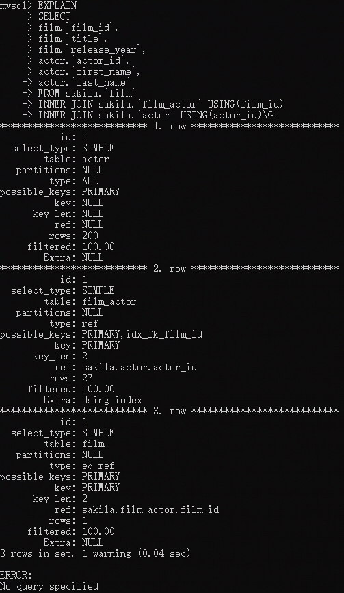
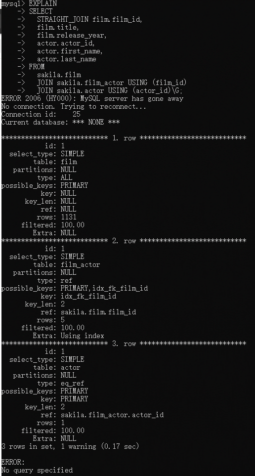
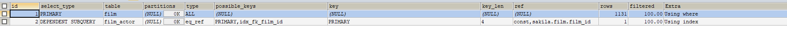
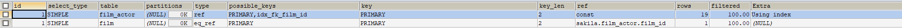
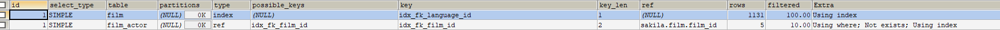

# 查询优化

查询优化，索引优化，库表结构优化需要一起考虑才可以。

## 查询速度变慢的原因？

查询可以看作是一个任务,这个任务由一系列的子任务组成,每个子任务都会消耗一定的时间。如果要实现查询的优化就需要优化子任务，
要么消除其中的一些子任务，要么煎炒子任务的执行次数，要么让子任务运行得更加快。


## 慢查询基础:优化数据访问

低效的查询，下面的两个步骤总是很有效：

1. 确认应用程序是否在检索大量超过需要的数据，这些通常意味访问了太多的行，但有时候也可能是访问了太多的列。

2. 确认MySQL服务器层是否在分析大量超过需要的数据行.


### 请求了不需要的数据

查询了多余的数据，增加了MySQL服务器的负担，增加了网络的开销，另外增加对服务器的CPU的消耗和内存资源占用。


### MySQL是否在扫描额外的记录

查看查询是否扫描了过多的数据，对于MySQL,最简单的查询开销的指标如下：

* 响应时间
响应时间分两部分，服务时间和排队时间。服务时间是指数据库处理这个查询的真正的花了多长时间。
排队时间是指服务器因为等待某些资源而没有真正的执行查询的时间-----可能是一些I/O操作完成或者等待锁。


* 扫描的行数
* 返回的数据

分析查询时，查看该查询扫描的行数是很有帮助的。在一定程度上能够说明该查询找到需要的数据的效率不高。

 1. 扫描的行数和访问的类型
 
 在评估查询开销的时候，需要考虑一下从表中找到某一行的数据成本。在EXPLAIN语句中的type列反应了访问的类型。访问类型有很多种，从全表扫描，
 范围扫描，唯一索引查询，常数索引。这些都是的查询的速度都是从慢到快，扫描的行数也是从小到大，
 
  走索引的方式


  不走索引的方式
  
  
通过上面的方式可以知道走索引可以知道扫描的函数会很少，如果不走索引机会全表扫描。


一般MySQL能够使用如下的三种方式应用where条件，从好到坏依次为：
1. * 在索引中使用WHERE条件来过滤不匹配的的记录。这是在存储引擎层完成的。

2. * 使用所有覆盖扫描(在Extra列出现Using index)来返回记录，直接从索引中过滤不需要的记录并返回命中
的结果。这是在MySQL服务器层完成的，但是无需再徽标查询记录。


3. * 从数据表中返回数据，然后过滤不满足条件的记录(再Extra列中出现Using Where)。这在MySQL服务器层完成。
MySQL需要先从数据表读出记录然后过滤。


扫描大量的数据但是只返回少数的行，通常可以尝试下面的技巧优化：

1. 使用索引覆盖扫描，把所有需要的列都放在索引中，这样存储引擎无需徽标获取对应的行就可以返回结果了。

2. 该表表结构，建立单独的汇总表。

3. 重写复杂的查询。


  
  
## 重构查询的方式

### 一个复杂的查询还是多个简单查询

现代的MySQL已经可以实现连接和断开轻量级化，返回以恶搞很小的查询的结构方面都很高效。
现代的网络速度比以前要快很多，多个小查询都不在是大问题。但是如果一个查询可以完成就没
必要拆分多个查询。


### 切分大查询


一般一个大查询都采用切分的方式，将大查询切分成几个小的查询来实现。就比如说一个大的操作可能需要锁住很多数据，占满了整个事务日志，
耗尽系统的资源，阻塞很多小的但是很重要的查询。这样可以将原本一次性的压力都分散到了一个很长的时间段中，就可以大大降低对服务器的影响。
还可以大大的减少删除时锁的持有时间。


###分解关联查询


分解查询的优势：


* 让缓存的效率更高


* 将查询分解后，执行单个查询可以减少锁的竞争。


* 在应用层关联可以更加容易对数据进行拆分，更容易做到高性能和可扩展。

* 查询本身效率也可能会有所提升。


* 可以减少冗余记录的查询


* 这样相当于在应用中实现了哈希关联，比MySQL的嵌套关联，某些场景哈希关联的效率更高。


## 查询执行的基础

希望MySQL以更高效的性能运行查询，最好的方法就是弄清楚MySQL是如何优化和执行查询的。
MySQL在我们发生一个请求之后，它执行的的过程如下：


1. 客户端发生一条查询给服务器。

2. 服务器先检查查询缓存，如果命中了缓存，则立刻返回存储中的结果，否则进入下一个阶段。

3. 服务器进行SQL解析，预处理，再有优化器生产的对应的执行计划。

4. MySQL根据优化器生成的执行计划，调用存储引擎的API来执行查询。

5. 将结果返回给客户端。


### MySQL客户端/服务器的通信协议

半双工的方式进行交互


### 查询状态


对于一个MySQL连接，或者说一个线程，任何时刻都有一个状态，该状态标识了MySQL当前正在做什么。很多种方式都能够查看当前的状态，最
简单的方式是使用SHOW FULL PROCESSLIST命令，在一个查询的生命周期种，状态会变化很多次。

* Sleep:线程正在等待客户端达式新的请求

* Query:线程正在执行查询的或者正在将结果发送给客户端

* Locked:在MySQL服务层，该线程正在等待表锁。在存储引擎级别实现的锁，例如InnoDB的行级锁，并不会体现在线程状态中。对于MyISAM来说这
是一个比较典型的状态，但是在其他没有行锁的引擎中也会经常会出现。

* Analyzing and statistics: 线程正在手机存储引擎的统计信息，并生成查询的执行计划

* Copy to tmp table [on disk]:线程正在执行查询，并且将结果复制到一个临时表，这种状态要么是GROUP BY 操作，要么是文件排序操作，
或者是一个UNION操作。如果有"on disk"标记，那么标识MySQL正在将内存的临时表放在磁盘上

* Sorting result 线程对结果集进行排序

* Sending data 线程可能在多个状态之间传送数据，或者在生成结果集，或者在项客户端返回数据。

### 查询缓存

解析查詢語句之前，如果开启了缓存，那么MySQL会有限检查缓存是否命中查询的数据。这个检查时通过一个对大小写敏感的哈希查找实现的。
查询缓存和缓存的中的拆线呢即使只有一个字节不同，都不会匹配缓存，查询将进入下一个阶段的处理.

### 查询优化处理

查询的生命周期的下一步时将SQL转换成执行计划，MySQL再依照这个执行计划和存储引擎进行交互。这个过程包括了多个子阶段：
解析SQL，预处理，优化SQL执行计划。

* 语法解析器和预处理


MySQL通过关键字将SQL语句进行解析，并且生成一颗对于的"解析树"。MySQL解析器将使用MySQL语法规则验证和解析查询。


* 查询优化器

优化器的作用时找到其中组好的执行计划。MySQL使用基于成本的优化器，它将尝试预测一个查询使用了某种执行计划时的陈海波，并选择其中
一个成本最小的。我们可以查询当前会话的Last_query_cost的值来得值MySQL计算当前查询的成本.

例如：


SELECT SQL_NO_CACHE COUNT(*) FROM sakila.`film_actor`;
SHOW STATUS LIKE 'last_query_cost';


这个结果标识MySQL的优化器大概需要做1104个数据也得随机查找才能完成上面得查询。

很多种原因导致MySQL优化器选择错误得执行计划：

1. 统计信息不准确
2. 执行计划种得成本估算不等同于实际执行得成本。
3. MySQL得最优可能和我们想得不一样。
4. MySQL也并不是任何时候都是基于成本的优化。
5. MySQL不会考虑不受其控制的操作的成本。
6. 优化器无法估算所有可能的执行计划，可能会错过实际上最优的执行计划.


优化器的的优化方式


1. 静态优化

可以直接对解析树进行优化。


2. 动态优化

和查询的上下文相关。


静态优化和动态优化的区别：静态优化只需要做一次，但是动态优化需要则在每次执行的时候都需要重新评估，甚至查询的时候后会重新评估。


#### 重新定义冠梁表的顺序


* 将外链接转化成内连接
并不是所有的OUTER JOIN语句都必须以外链接的方式执行的，例如WHERE条件和库表结构都可能会让外链接等价于一个内连接。


* 使用等价变换规则
MySQL可以使用一些等价换来简化并规范表达式。可以合并一些恒成立或者恒不成立的判断。


* 优化COUNT(),MIN()和MAX()

索引通常可以帮助优化这类表达式。

例子：

EXPLAIN SELECT MAX(actor_id) FROM `actor`
执行结果:


可以看到Extra列的值是"Select table optimized away"表示优化器已经从执行计划移除了该表


* 预估并转化为常数表达式

MySQL检测到一个表达式转化为常数的时候，就会一直把该表达式座位常数进行优化处理

例子:


EXPLAIN 
SELECT 
film.`film_id`,film_actor.`actor_id`
FROM sakila.`film`
INNER JOIN sakila.`film_actor` USING(film_id)
WHERE film.`film_id`=1;	


* 覆盖索引扫描

当索引中的列包含索引查询中需要使用的列的时候，MySQL就可以使用索引返回需要的数据,无需查询对应的数据行。


* 子查询的优化

在某些情况下子查询可以转化为一直效率更高的形式，从而减少多个查询的多次对数据的进行访问。


* 提前终止查询

发现查询满足需要的时候，MySQL总是可以能够立刻终止查询。一个典型的例子是使用limit自居的时候


* 等值传播

如果两个列的值通过等式关联,那么MySQL能够把其中一个列的where条件传递到另一列。

例子：

SELECT film.`film_id`
FROM sakila.`film`
INNER JOIN sakila.`film_actor` USING(film_id)
WHERE film.`film_id`>500;

这个字段的条件不仅适合于film还适合file_actor的film_id,优化器会吧它转移到film_actor:

film.`film_id`>500 and film_actor.`film_id`>500

* 列表IN()的比较

in完全等同于多个or条件链接，但是in列表的数据先进行拍讯，然后使用二分查找的方式来确定列的值是否满足条件，这个时间复杂度是O(log n)
复杂度，or的多个条件链接是O(n)复杂度。

### 数据和索引的统计信息

统计信息有存储引擎来实现，不同的存储引起可能会存储不同的信息(也可以按照不同的格式存储统计的信息)。服务器层是不存在统计信息的，
所以MySQL的优化器需要向存储引起获取响应的统计信息(例如：每个表或者索引有多少个页面)。每个标鸟的每个索引的基数是多少。


### MySQL如何执行关联查询


在MySQL种每一个查询，没一个片段(包括子查询，甚至基于单表的SELECT)都可能是关联.例如：UNION查询的，MySQL先将一系列的查询先放到
一个临时表中，然后再重新读取临时表数据来完成UNION查询。

MySQL关联执行的策略：MySQL对任何关联执行嵌套的循环的关联操作，即MySQL先在一个表中循环取出单挑数据，然后再嵌套循环到以一个表中
寻找匹配的行，依次下去，直到找到所有表中匹配的行为止。


#### 执行计划

    和很多其他的数据库不同，MySQL并不会生成查询字节码来执行查询。MySQL生成的查询的以可指令树，然后通过存储引擎执行完成这颗指令树并返回结果。


#### 关联查询优化器


MySQL优化器最重要的一部分就是关联查询优化，它决定了多个表关联的顺序。多个表关联的时候可以有多种不同的关联顺序来获得相同的执行结果。
查询优化器则通过评估不同顺序时的成本来选择一个代价最小的关联顺序。


例子

    EXPLAIN 
    SELECT 
    film.`film_id`,
    film.`title`,
    film.`release_year`,
    actor.`actor_id`,
    actor.`first_name`,
    actor.`last_name`
    FROM sakila.`film`
    INNER JOIN sakila.`film_actor` USING(film_id)
    INNER JOIN sakila.`actor` USING(actor_id)\G;



以上的例子时优化之后的执行顺序，如果我们时顺序的执行，然后执行的计划会是怎么样的？


    EXPLAIN 
    SELECT 
      STRAIGHT_JOIN film.film_id,
      film.title,
      film.release_year,
      actor.actor_id,
      actor.first_name,
      actor.last_name 
    FROM
      sakila.film 
      JOIN sakila.film_actor USING (film_id) 
      JOIN sakila.actor USING (actor_id);




以上的例子説明了MySQL是如何选择合适的关联顺序来让查询执行的成本尽可能的低。重新的定义关联的顺序是优化器非常重要的一部分功能。有时候
MySQL优化器是没法正确的给出最优的关联顺序，这个时候使用STRAIGHT JOIN 关键字重写查询，让优化器认为你的是最优的关联执行顺序。但是如果
关联的表超管了optimizer_search_depth的限制的时候，就会选择"贪婪"搜索的模式。


#### 排序优化

排序是一个成本很高的操作，从性能的角度考虑的话，应该尽可能的避免对大量的数据进行排序.当MySQL无法利用索引的顺序排序的时候就需要自
己进行排序，如果数据量小则可以再内存中进行，如果数据量很大则需要使用磁盘，这个过程统一成为文件排序。如果数据量小于"排序缓冲区"，Mysql
使用内存快速的排序，否则需要将数据分块，将对每个对立的块使用"快速排序"，将各个块存放再磁盘上，然后将排好序的块排序，返回结果.
SHOW VARIABLES LIKE 'optimizer_search_depth'


MySQL的两种排序算法

* 两次传输排序(旧版本使用)


    需要从数据表读取两次数据,第二次读取数据的时候，因为是读取排序列的进行排序后的索引记录，这个会长生大量的额随机I/O，所以两次数
    据传输的成本非常的高。


* 单次排序(新版本使用)

SHOW VARIABLES LIKE 'max_length_for_sort_data';


    先读取查询所需要的所以列，然后再根据给定的列进行排序，最后直接返回排序的结果。当查询的数据不超过max_length_for_sort_data就使用
    "单次传输排序"


## MySQL查询优化器的局限性


### 关联子查询


MySQL的子查询实现是非常糟糕的，特别是WHERE条件中包含IN()的子查询语句。

例子：
~~~

SELECT 
  * 
FROM
  sakila.`film` skf 
WHERE skf.`film_id` IN 
  (SELECT 
    film_id 
  FROM
    sakila.`film_actor` 
  WHERE actor_id = 1)

~~~
因为MSQL对于IN()列表中的选项有准们的优化策略，一般认为MySQL会执行子查询返回所有包含的actor_id
为1的film_id.一般来说，IN()列表查询速度很快，所以而我们会认为上面的查询会被成这样执行

~~~

SELECT * FROM sakila.film WHERE film_id IN(1,23,25.....);

)

~~~

但是MySQL 并没有按照我们所想的去执行，而是将查询按照下面的方式执行

~~~

SELECT *FROM sakila.film WHERE EXISTS(
SELECT *FROM sakila.film_actor WHERE actor_id=1
AND film_actor.film_id=film.film_id
);

~~~


这时，子查询需要根据film_id来关联外部表film,因为需要film_id字段，所以MySQL认为无法先执行这个子查询，通过EXPLAIN可以看到子查询
是一个西安不过关子查询：

EXPLAIN	
SELECT *FROM sakila.film WHERE EXISTS(
SELECT *FROM sakila.film_actor WHERE actor_id=1
AND film_actor.film_id=film.film_id
);





由上颗指，先选择file表进行全表扫描，然后根据film_id逐个执行子查询。如果是一个很小的表，这个糟糕的性能还不会引起注意，但是如果外层的表
是一个很大的表，那么这个查询的性能是非常糟糕的。


我们可以使用下面的方式重写


~~~

SELECT film.* FROM sakila.film
INNER JOIN sakila.film_actor using(film_id)
WHERE actor_id=1;

~~~

通过使用EXPLAIN可以看到



通过对比可以发现，下面的改进方式比上面的查询的数量少了很多.


* 其他的方式，可以使用EXISTS开代替IN()子查询的方式.


#### 用好子查询

并不是所有的子查询都是很差的，我们需要经过测试，然后做出自己的判断。


例子：

~~~

EXPLAIN SELECT film_id,language_id 
FROM sakila.`film`  
WHERE NOT EXISTS(
SELECT *FROM sakila.`film_actor`
WHERE film_actor.`film_id`=film.`film_id`
)

~~~


一般会建议使用左外连接(LEFT OUTER JOIN)重写该查询，以替代子查询。理论上改写的查询是没上面变化的

~~~
EXPLAIN SELECT film.`film_id`,film.`language_id`
FROM sakila.`film`
LEFT OUTER JOIN sakila.`film_actor` USING(film_id)
WHERE film_actor.`actor_id` IS NULL;

~~~



执行上面的脚本可以按看到还是由微笑的差别：
* film_actor的访问类型一个是DEPENDENT SUBQUERY,而零位一个是SIMPLE。这个不同是由于语句的写法
不同导致的，一个是普通的查询是，一个相关子查询，这个对于底层的接口来说没有上面不同

*第二个表film_actor的执行计划的Extra列有"Not exists"。这是一个提前终止的算法，MySQL通过
"Not exists"优化避免在表film_actor的所有中读取无任何额外的的行。这个瓦努请安等效于直接编写NOT
EXISTS子拆线呢，这个在执行记挂中也是已有的，一旦匹配到一行数据，就立刻停止扫描。


NOT EXISTS和左外连接性能比较


| 查询 | 每秒查询结果(QPS) |
| :-------- | --------:|
| NOT EXISTS子查询 | 360QPS | 
| LEFT OUTER JOIN | 425QPS | 


当然并不是子查询一定比关联查询要差，需要去亲自去验证之后才可以得出真正得结果


#### UNION得限制

MySQL无法将限制条件从外层"下推"到内层，这个使得原本能够部分返回结果得条件无法应用到内层查询到额优化条件上。
如果希望UNION的哥哥子句能够根据LIMIT只取部分结果集，或者能够先排好顺序再合并结果集的话，就徐奥UNION的各个子句
分别使用这些子句。将这两个子查询联合起来，然后再取前面的20条记录。


例子：

(SELECT first_name,last_name
FROM sakila.actor
ORDER BY last_name)
UNION ALL
(SELECT first_name,last_name
FROM sakila.customer
ORDER BY last_name)
LIMIT 20


这个查询会把actor的200条记录和cutomer表的599条记录存放在一个临时表中，然后再从临时表中读取出前面的20条记录，
这种方式会增加内存的压力，但是如果分别在子句添加limit限制可以只在临时表存储需要的行就可以了。
(SELECT first_name,last_name
FROM sakila.actor
ORDER BY last_name
LIMIT 20)
UNION ALL
(SELECT first_name,last_name
FROM sakila.customer
ORDER BY last_name LIMIT 20)
LIMIT 20;

#### 索引合并优化


#### 等值传递
 
 等值传递会带来一些一项不到的额外消耗。例如IN()是一个非常大的表，而MySQL优化器发现存在WHERE,ON或者USING的子句，将这个列表i的只
 和另一个表的某个列相关联。
 MySQL优化器会将IN()列表都复制到应用到关联的各个表中。
 
 
 
#### 合并执行

MySQL无法利用多核特性来并行的执行查询


#### 哈希关联
 MySQL不支持哈希关联，支持嵌套循环关联
 
 
 
#### 松散索引扫描
 
 MySQL不支持松散关联(不连续的方式扫描一个索引)
 
 
#### 最大值和最小值的优化

对于MIN()和MAX()查询，Mysql的优化都做得并不好.

例子:

`
SELECT 
  MIN(actor_id) 
FROM
  sakila.`actor` 
WHERE first_name = 'PENELOPE' ;

`
因为first_name字段上没有索引，因此MySQL将会进行一次全表扫描。如果能够进行主键扫描，那么理论上，当MySQL读取到第一个满足条件得
记录得时候，就是我们需要找到最小值了，因为主键是严格按照actor_id字段得大小顺序排序得。但是MySQL这个时候会做全表扫描，我们可以通过
查看SHOW STATUS得全表扫描计数器老验证这一点，理想得办法就是使用limit来移除MIN().


`
SELECT actor_id 
FROM sakila.`actor` USE INDEX(PRIMARY)
WHERE first_name = 'PENELOPE'  LIMIT 1;

`

#### 在同一个表上查询和更新

MySQL不允许对同一张表同时进行查询和更新操作.

```$xslt
UPDATE `actor` SET first_name=(SELECT first_name FROM `actor` WHERE actor_id=1);

```


可以通过生成临表来解决上面得问题

如下:


```
UPDATE `actor` tb1,(SELECT * FROM `actor` WHERE actor_id=1) AS tb2
SET tb1.`first_name`=tb2.`first_name`;
```


#### 查询优化器得提示(hint)


## 优化特定类型的查询


### 优化COUNT()查询
COUNT()聚合函数,这个函数的作用是统计结果集的行数。这个函数有两种不同作用：可以统计某个列
值，也可以统计行数。在同i列值是非空(不统计NULL)。如果在COUNT()的括号内指定了列或者列
的表达式，则统计就是这个表达式有值的结果数。
COUNT()的另一个作用是统计结果集的行数。当MySQL确认括号内的标识值不可能为空时，实际上就是同hi行数。最简单就是使用COUNT(*)的时候，这种情况下
通配符`*`并不会像我们猜想的那样扩展成索引的列，实际上，它会忽略所有列的而直接统计所有的行数

#### MyISAM的神话

MyISAM的COUNT(*)函数总是非常快，这是建立在没有任何WHERE条件按的COUNT(*)才是最快的。因此此时无需实际地去计算行数。
MySQL可以利用粗出一起的特性直接获得是这个值。

简单的优化：
 
有时候可以使用MyISAM在COUNT(*)全表非常快的这个特性，来加速一些条件的COUNT的查询

例子:

```$xslt


EXPLAIN SELECT COUNT(*) FROM 
sakila.`actor`  WHERE actor_id>5;


```
这个时候需要全表扫描，如果用id<=5的，在使用总是减去也可以得到切确的数据

```$xslt
EXPLAIN SELECT (SELECT COUNT(*) FROM sakila.`actor`)-COUNT(*)
FROM sakila.`actor` WHERE  actor_id<=5;

```
这个时候只需要扫面前面几行..


近似值估计：

如果需要的数据不是需要的精确的计算，那么可以使用EXPLAIN的估算的方式来获取这个数据
而且这种方式的执行速度试比较快的。


更复杂的优化：

一般快速，精确和简单这个三者蝾螈只能满足其中两个，必须要舍弃其中一个。其实COUNT()函数一般都是要扫描大量的行，
要做优化还是比较困难的，可以考虑缓存的方式.


### 优化关联查询

* 确保ON或者USING子句的列上有索引,在创建索引的时候就压迫考虑关联的顺序。一般需要在关联的第二个表
对应的列上创建索引。

* 确保任何GROUP BY 和ORDER BY中的表达式值涉及到一个表中的列，这样的MySQL才能使用索引来洋浦话这个过程.

* 当涉及MySQL的时候需要注意：关联语法，预算符优先级等吉他可能会发生变化的地方。因为以前普通关联的地方可能会变成笛卡尔积，不同的、
关联类型可能会生成不同的结果。


### 优化子查询


尽可能使用关联代替子查询.

### 优化GROUP BY和DISTINCT 


在MySQL中，当无法使用索引的时候，GROUP BY 使用两种测率被来完成，，使用临时表或者文件排序来做分组。
对于任何查询语句，这两种策略的性能都可以提升的地方。可以使用SQL_BIG_RESULT和SQL_SMALL_RESULT来让优化器
按照你希望的方式运行。

如果需要对关联查询做分组，并且按照查表中的某个列进行分组，那么通常采用的查找的标识列分组的效率更高。
下面的查询语句的查询效率不是很高
```$xslt

SELECT actor.`first_name`,actor.`last_name`,COUNT(*)
FROM sakila.`film_actor`
INNER JOIN sakila.`actor` USING(actor_id)
GROUP BY actor.`first_name`,actor.`last_name`;


```

下面这种查询的方式效率更高:


```$xslt

SELECT actor.`first_name`,actor.`last_name`,COUNT(*)
FROM sakila.`film_actor`
INNER JOIN sakila.`actor` USING(actor_id)
GROUP BY film_actor.`actor_id`;

```

对于group by 如果不关心排序的顺序，那么很可能试文件拍寻，此时可以使用ORDER BY NULL，让MySQL不使用文件排序.


* 优化GROUP BY WITH ROLLUP (主要试在group by统计的基础上再做一个统计)

分组查询的一个变种就是要求MySQL对返回的结果在做一次超级给，可以使用WITH ROLLUP子句
来实现这种逻辑，但是可能不够优化，可以试有EXPLAIN来查看执行计划，特别要注意分组是否真通过文件拍寻或者临时表实现的。
然后去掉WITH ROLLUP子句查看是否相同。


### 优化LIMIT分页

我们可以使用Limit进行分页，但是通常使用limit分页偏移量很大的时候就会需要查找大量的数据，但是最后只是返回少数的数据是我们需要的，
大多数都是丢弃的。


例子
```$xslt

EXPLAIN SELECT film_id,description
FROM sakila.`film` 
ORDER BY title LIMIT 50, 5;

```


从上面的图可以知道，需要获取很多的数据，但是最后却只需要前面的几行数据，最后把大部分的数据丢弃，这个对于我们威严试浪费的。


解决的方法：


```$xslt

EXPLAIN SELECT film.`film_id`,film.`description`
FROM sakila.`film`
INNER JOIN (
SELECT film_id
FROM sakila.`film`
ORDER BY title LIMIT 50,5
) AS lim USING(film_id);

```


### 优化SQL_CALC_FOUND_ROWS

分页的时候，另一个常见的技巧是在LIMIT语句中加上SQL_CALC_FOUNDS提示(hint),这样就可以去掉LIMIT以后满足的添加的行数，
可作为分页的总数。实际上，MySQL是扫描了索引的行之后才会知道索引的行数，所以这个操作成本还是很高的。


### 优化UNION查询

MySQL总是创建临时表来填充表的方式来执行UNION查询。我们可以通过将WHERE,LIMIT,ORDER BY 吓退到UNION的各个查询中，
以便优化器充分利用这些条件进行优化。


 
 
 


 
 
 
 


     


